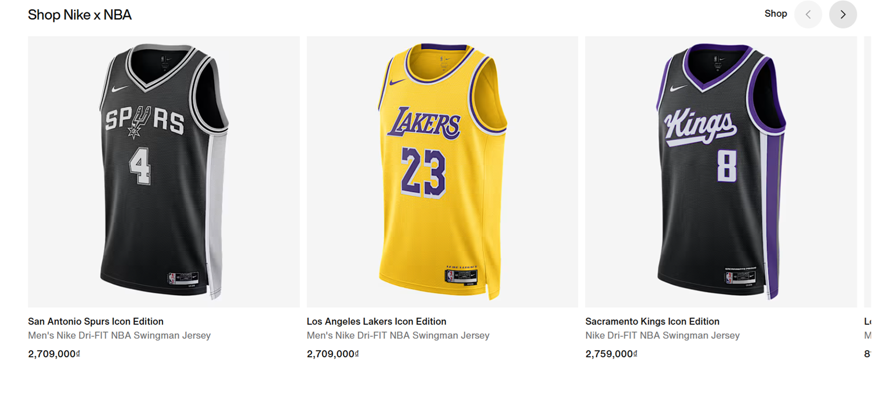

<p align="center">
  
</p>

<h1 align="center">🏃‍♂️ Nike E-Commerce Web Application</h1>
<p align="center"><em>"Just Do It" - Now with Enterprise-Grade Architecture</em></p>

<p align="center">
  <a href="https://spring.io/projects/spring-boot"></a>
  <a href="https://www.oracle.com/java/"></a>
  <a href="https://maven.apache.org/"></a>
  <a href="https://www.mysql.com/"></a>
  <a href="https://docker.com"></a>
  <a href="https://hibernate.org/"></a>
  <a href="https://spring.io/guides/gs/serving-web-content/"></a>
  <a href="https://flywaydb.org/"></a>
  <a href="https://junit.org/junit5/"></a>
  <a href="https://spring.io/projects/spring-security"></a>
</p>

---

## 🚀 Overview

Welcome to the **Nike E-Commerce Web Application** – where championship performance meets cutting-edge technology. Built with enterprise-grade Spring Boot architecture, this application delivers an unparalleled shopping experience with comprehensive customer and admin functionalities.

This full-stack e-commerce platform provides a complete online shopping solution with modern web technologies, secure authentication, robust testing framework, and scalable architecture designed for high performance and maintainability.

---

## 📑 Table of Contents
- [✨ Features](#features)
- [🛠 Tech Stack](#tech-stack)
- [🏗 Architecture](#architecture)
- [🎨 Frontend Technologies](#frontend-technologies)
- [⚙️ Backend Architecture](#backend-architecture)
- [🔒 Security Framework](#security-framework)
- [🧪 Testing & Quality Assurance](#testing-quality)
- [⚠️ Exception Handling](#exception-handling)
- [🚀 Getting Started](#getting-started)
- [📊 Database Schema](#database-schema)
- [🔧 Configuration](#configuration)
- [📱 API Endpoints](#api-endpoints)
- [🎯 Usage Examples](#usage-examples)
- [📁 Project Structure](#project-structure)
- [🧭 Documentation Map](#documentation-map)
- [⚡ Quick Start](#quick-start)
- [🔐 Configuration & Secrets](#configuration-secrets)
- [🗂 Project Structure (Excerpt)](#project-structure-excerpt)
- [♻ Build Profiles](#build-profiles)
- [🧪 Test Commands](#test-commands)
- [🖼 Front-End Asset Strategy](#front-end-asset-strategy)
- [🚨 Security Notes](#security-notes)
- [🛣 Roadmap](#roadmap)
- [⚖ Trademark / License Notice](#trademark-license-notice)
- [🙌 Contributing](#contributing)
- [✅ Change Log](#change-log)
- [📄 License](#license)

## ✨ Features <a id="features"></a>

### 🛍️ Customer Features
- **User Registration & Authentication** - Secure signup/login with Spring Security & BCrypt encryption
- **Product Catalog** - Browse Nike products with advanced filtering, search, and sorting
- **Product Details** - Detailed product pages with multiple images, variants (size/color), and pricing
- **Shopping Cart** - Real-time cart management with variant-specific pricing
- **User Profile** - Comprehensive profile management with contact information
- **Product Reviews & Feedback** - Rate and review products with persistent feedback system
- **Responsive Design** - Mobile-first responsive interface with Bootstrap integration

### 👨‍💼 Admin Features
- **Product Management** - Full CRUD operations with multi-variant support (size, color, pricing)
- **Category Management** - Hierarchical category organization
- **Customer Management** - User account administration and role management
- **File Management** - Advanced image upload with automatic file organization
- **Dashboard Analytics** - Comprehensive admin dashboard with system insights
- **Content Management** - SEO-optimized product descriptions and metadata

### 🔒 Security & Authentication
- **Spring Security Integration** - Role-based access control (USER/ADMIN)
- **BCrypt Password Encryption** - Industry-standard password hashing
- **Session Management** - Secure session handling with timeout protection
- **CSRF Protection** - Cross-site request forgery prevention
- **Custom Authentication** - Email-based login with credential validation



## 🛠 Tech Stack <a id="tech-stack"></a>

### Backend Framework
- **Java 17** - Modern Java with enhanced performance and language features
- **Spring Boot 2.7.18** - Production-ready application framework
- **Spring MVC** - Model-View-Controller web architecture
- **Spring Data JPA** - Simplified data access with repository pattern
- **Spring Security** - Comprehensive security framework
- **Hibernate** - Advanced ORM with MySQL dialect optimization
- **Maven** - Dependency management and build automation

### Database & Persistence
- **MySQL 8.0** - Primary relational database
- **Flyway** - Database migration and version control
- **JPA/Hibernate** - Object-relational mapping with entity relationships
- **Connection Pooling** - Optimized database connection management

### Frontend Technologies
- **JSP (Java Server Pages)** - Server-side rendering with JSTL integration
- **Bootstrap 5** - Responsive CSS framework with custom styling
- **JavaScript/jQuery** - Client-side interactivity and AJAX operations
- **SCSS** - Enhanced CSS preprocessing for maintainable stylesheets
- **Custom CSS** - Specialized styling for Nike brand consistency

### Testing & Quality
- **JUnit 5** - Modern testing framework with advanced assertions
- **Spring Boot Test** - Integration testing with test slices
- **Transactional Testing** - Database rollback for isolated test execution
- **Parameterized Tests** - Data-driven testing capabilities

### DevOps & Infrastructure
- **Docker Compose** - Containerized development environment
- **Maven Surefire** - Test execution and reporting
- **Embedded Tomcat** - Production-ready servlet container

---

## 🏗 Architecture <a id="architecture"></a>

The application implements a **layered MVC architecture** with clear separation of concerns and dependency inversion:

```
┌─────────────────────────────────────────┐
│           Presentation Layer            │
│     Controllers (MVC + REST API)        │
│   - Customer Controllers                │
│   - Admin Controllers                   │
│   - Authentication Controllers          │
│   - API Controllers (JSON responses)    │
├─────────────────────────────────────────┤
│              Service Layer              │
│          Business Logic                 │
│   - AuthService (Authentication)        │
│   - ProductService (Catalog mgmt)       │
│   - CartService (Shopping cart)         │
│   - FileStorageService (File handling)  │
├─────────────────────────────────────────┤
│           Repository Layer              │
│         Data Access Objects            │
│   - Spring Data JPA Repositories       │
│   - Custom Query Methods               │
│   - Transaction Management             │
├─────────────────────────────────────────┤
│             Entity Layer                │
│          Domain Models                  │
│   - Customer, Product, Order entities  │
│   - JPA Relationships & Constraints    │
│   - Audit Fields (created/updated)     │
└─────────────────────────────────────────┘
```

---

## 🎨 Frontend Technologies <a id="frontend-technologies"></a>

### View Layer Architecture
- **JSP Templates** - Server-side rendering with shared layouts
- **Component-based Design** - Reusable header, footer, and navigation components
- **Responsive Layouts** - Mobile-first design with Bootstrap grid system
- **Custom SCSS** - Modularized stylesheets for maintainable CSS

### UI Components
- **Product Catalog** - Grid/list view with filtering and pagination
- **Shopping Cart** - Dynamic cart updates with variant pricing
- **User Forms** - Validation-enhanced registration and profile forms
- **Admin Interface** - Data tables with CRUD operations
- **File Upload** - Multi-file upload with preview functionality

### Client-Side Features
- **AJAX Integration** - Asynchronous cart operations and form submissions
- **Form Validation** - Client-side validation with server-side verification
- **Image Handling** - Lazy loading and responsive image optimization
- **Interactive Elements** - Dynamic product variant selection

---

## ⚙️ Backend Architecture <a id="backend-architecture"></a>

### MVC Implementation
- **Controllers** - 11+ specialized controllers handling web and API requests
- **Services** - 13+ business logic services with transaction management
- **Repositories** - Spring Data JPA repositories with custom queries
- **DTOs** - Data Transfer Objects for API communication and form binding

### Key Services
- **AuthService** - User registration, login, and credential management
- **ProductService** - Product catalog operations and variant management
- **CartService** - Shopping cart persistence and calculations
- **FileStorageService** - Image upload, processing, and organization
- **CurrentUserService** - Session management and user context

### Data Management
- **Entity Relationships** - Complex JPA relationships (OneToMany, ManyToOne)
- **Variant-based Pricing** - Size and color-specific product pricing
- **Audit Trail** - Created/updated timestamps on all entities
- **Cascade Operations** - Proper entity lifecycle management

---

## 🔒 Security Framework <a id="security-framework"></a>

### Spring Security Configuration
```java
import org.springframework.security.config.annotation.web.configuration.EnableWebSecurity;

@EnableWebSecurity
public class SecurityConfig { // Simplified skeleton
    // 1. PasswordEncoder bean (BCrypt)
    // 2. HttpSecurity rules (authorize requests, csrf, headers)
    // 3. UserDetailsService integration
    // 4. Session management (fixation protection, timeout)
    // 5. Remember-me & logout configuration (optional)
}
```

### Authentication Features
- **Email-based Login** - User authentication via email address
- **Password Validation** - Strong password requirements with pattern matching
- **Account Management** - Account locking and enabling capabilities
- **Role Management** - Hierarchical role assignment and verification

### Access Control
- **URL-based Security** - Method-level access control
- **CSRF Protection** - Token-based request validation
- **Session Security** - Secure session cookie configuration
- **API Security** - REST endpoint protection with role verification

---

## 🧪 Testing & Quality Assurance <a id="testing-quality"></a>

### Testing Framework
- **JUnit 5** - Modern testing with DisplayName annotations and advanced assertions
- **Spring Boot Test** - Full application context testing with test slices
- **Integration Tests** - Database integration with @Transactional rollback
- **Unit Tests** - Service layer testing with dependency injection

### Test Coverage
```java
@SpringBootTest
class SignupPersistenceTest {
    @Test
    @DisplayName("Register creates Customer + Credential with encoded password")
    @Transactional
    void registerPersistsEntities() {
        // Comprehensive user registration testing
        // Password encoding verification
        // Database persistence validation
    }
}
```

### Testing Capabilities
- **Authentication Testing** - User registration and login validation
- **Password Security** - Encryption and matching verification
- **Data Persistence** - Entity relationship testing
- **Exception Handling** - Error scenario validation
- **Duplicate Prevention** - Constraint violation testing

---

## ⚠️ Exception Handling <a id="exception-handling"></a>

### Comprehensive Error Management
The application implements robust exception handling across all layers:

### Custom Exception Types
- **IllegalArgumentException** - Input validation errors
- **DataIntegrityViolationException** - Database constraint violations
- **UsernameNotFoundException** - Authentication failures
- **IOException** - File operation errors

### Validation & Error Handling
```java
// Example service-level validation method
public void validateRegistration(RegistrationRequest req) {
    if (req == null) {
        throw new IllegalArgumentException("Request is required");
    }
    if (req.getUsername() == null || req.getUsername().isBlank()) {
        throw new IllegalArgumentException("Username is required");
    }
    if (emailExists(req.getEmail())) {
        throw new IllegalArgumentException("Email already exists");
    }
    if (!isStrongPassword(req.getPassword())) {
        throw new IllegalArgumentException("Password must be at least 8 chars incl. upper, lower & digit");
    }
}
```

### Error Handling Patterns
- **Service Layer Validation** - Input validation with descriptive error messages
- **Database Constraint Handling** - Graceful handling of unique constraint violations
- **File Operation Errors** - Comprehensive IOException handling for uploads
- **Authentication Failures** - Secure error messages preventing information disclosure

### Global Error Handling
- **@ControllerAdvice** - Global exception handling across controllers
- **Custom Error Pages** - User-friendly error page rendering
- **Logging Integration** - Comprehensive error logging for debugging
- **Transaction Rollback** - Automatic rollback on service layer exceptions

---

## 🚀 Getting Started <a id="getting-started"></a>

### Prerequisites
- **Java 17** or higher (OpenJDK recommended)
- **Maven 3.6+** for dependency management
- **Docker & Docker Compose** for database setup
- **Git** for version control

### Installation Steps

1. **Clone the Repository**
   ```bash
   git clone https://github.com/yourusername/Nike-e-commerce-web-application.git
   cd Nike-e-commerce-web-application
   ```

2. **Database Setup**
   ```bash
   # Start MySQL container
   docker-compose up -d
   
   # Verify database is running
   docker-compose ps
   ```

3. **Application Build**
   ```bash
   # Clean and compile
   mvn clean compile
   
   # Run tests
   mvn test
   
   # Package application
   mvn package -DskipTests
   ```

4. **Run Application**
   ```bash
   # Development mode
   mvn spring-boot:run
   
   # Or run packaged JAR
   java -jar target/Nike-Ecommerce-Application.jar
   ```

5. **Access Application**
   - **Customer Portal**: http://localhost:9090
   - **Admin Dashboard**: http://localhost:9090/admin
   - **API Endpoints**: http://localhost:9090/api/*

---

## 📊 Database Schema <a id="database-schema"></a>

### Core Entities
- **Customer Management**: `customers`, `credentials`, `addresses`, `contact_info`
- **Product Catalog**: `products`, `product_variants`, `product_images`, `product_colors`, `categories`
- **Shopping & Orders**: `cart_items`, `orders`, `order_items`
- **Content**: `reviews`, `feedback`

### Advanced Features
- **Variant-based Pricing** - Size and color-specific pricing in `product_variants`
- **Image Management** - Color-specific image organization
- **Audit Fields** - Created/updated timestamps on all entities
- **Referential Integrity** - Foreign key constraints with cascade options

---

## 🔧 Configuration <a id="configuration"></a>

### Application Properties
```properties
# Server Configuration
server.port=9090
server.servlet.context-path=/

# Database Configuration
spring.datasource.url=jdbc:mysql://127.0.0.1:3307/nike_store?useSSL=false
spring.datasource.username=root
spring.datasource.password=${DB_PASSWORD:CHANGE_ME}

# JPA & HibernateConfiguration
spring.jpa.database-platform=org.hibernate.dialect.MySQL8Dialect
spring.jpa.hibernate.ddl-auto=update
spring.jpa.show-sql=true
spring.jpa.properties.hibernate.format_sql=true

# View Resolution
spring.mvc.view.prefix=/WEB-INF/views/
spring.mvc.view.suffix=.jsp

# File Upload Configuration
spring.servlet.multipart.max-file-size=10MB
spring.servlet.multipart.max-request-size=50MB

# Security Configuration
spring.security.enabled=true
logging.level.org.springframework.security=DEBUG
```

---

## 📱 API Endpoints <a id="api-endpoints"></a>

### Customer Endpoints
- `GET /` - Landing page with featured products
- `GET /products` - Product catalog with filtering
- `GET /product/{id}` - Detailed product view
- `POST /api/cart/add` - Add item to cart (AJAX)
- `GET /cart` - Shopping cart view
- `POST /auth/register` - User registration
- `POST /auth/login` - User authentication
- `GET /profile` - User profile management

### Admin Endpoints
- `GET /admin` - Admin dashboard
- `GET /admin/product/list` - Product management interface
- `POST /admin/product/add-save` - Create new product
- `GET /admin/product/edit/{id}` - Edit product form
- `POST /admin/product/edit-save` - Update product
- `GET /admin/product/delete/{id}` - Delete product

### REST API
- `GET /api/products` - JSON product catalog
- `POST /api/cart/add` - Add to cart (JSON response)
- `GET /api/cart/items` - Cart contents (JSON)

---

## 🎯 Usage Examples <a id="usage-examples"></a>

### Customer Workflow
1. **Registration** - Create account with email verification
2. **Browse Products** - Filter by category, price, size, color
3. **Product Selection** - Choose variants and add to cart
4. **Cart Management** - Review items with variant-specific pricing
5. **Profile Management** - Update personal information

### Admin Workflow
1. **Product Creation** - Add products with multiple variants
2. **Image Management** - Upload and organize product images
3. **Category Management** - Organize product hierarchy
4. **Customer Management** - Monitor user accounts and activities

---

## 📁 Enhanced Project Structure <a id="project-structure"></a>

```
Nike-e-commerce-web-application/
├── src/
│   ├── main/
│   │   ├── java/vn/devpro/javaweb32/
│   │   │   ├── entity/          # JPA Entities with relationships
│   │   │   │   ├── customer/    # Customer, Credential, Address
│   │   │   │   ├── product/     # Product, ProductVariant, ProductColor, ProductImage
│   │   │   │   ├── cart/        # CartItem with variant pricing
│   │   │   │   └── order/       # Order processing entities
│   │   │   ├── repository/      # Spring Data JPA repositories
│   │   │   ├── service/         # Business logic layer
│   │   │   │   ├── administrator/ # Admin-specific services
│   │   │   │   ├── customer/    # Customer-facing services
│   │   │   │   └── impl/        # Service implementations
│   │   │   ├── controller/      # MVC Controllers
│   │   │   │   ├── customer/    # Customer portal controllers
│   │   │   │   ├── administrator/ # Admin panel controllers
│   │   │   │   ├── auth/        # Authentication controllers
│   │   │   │   ├── product/     # Product & API controllers
│   │   │   │   └── cart/        # Shopping cart controllers
│   │   │   ├── dto/             # Data Transfer Objects
│   │   │   │   ├── customer/    # Customer-facing DTOs
│   │   │   │   └── administrator/ # Admin DTOs
│   │   │   ├── config/          # Configuration classes
│   │   │   │   ├── SecurityConfig.java # Spring Security setup
│   │   │   │   ├── MvcConfig.java      # MVC configuration
│   │   │   │   └── GlobalModelAttributes.java # Global model data
│   │   │   └── common/          # Utilities and constants
│   │   ├── resources/
│   │   │   ├── static/          # Frontend assets
│   │   │   │   ├── css/         # Custom stylesheets
│   │   │   │   ├── js/          # JavaScript files
│   │   │   │   └── images/      # Static images
│   │   │   ├── db/migration/    # Flyway migration scripts
│   │   │   └── application.properties # Application configuration
│   │   └── webapp/WEB-INF/views/
│   │       ├── customer/        # Customer-facing JSP pages
│   │       │   ├── index.jsp    # Landing page
│   │       │   ├── product-list.jsp # Product catalog
│   │       │   ├── product-detail.jsp # Product details
│   │       │   ├── checkout.jsp # Shopping cart
│   │       │   └── profile.jsp  # User profile
│   │       ├── administrator/   # Admin interface JSP pages
│   │       │   ├── home.jsp     # Admin dashboard
│   │       │   ├── product/     # Product management pages
│   │       │   └── category/    # Category management
│   │       └── common/          # Shared JSP components
│   └── test/
│       └── java/vn/devpro/javaweb32/
│           └── auth/            # Authentication tests
│               └── SignupPersistenceTest.java # Comprehensive auth testing
├── docker-compose.yml           # Database containerization
├── pom.xml                     # Maven dependencies & plugins
└── README.md                   # Comprehensive documentation
```

---

## 🧭 Documentation Map (New) <a id="documentation-map"></a>
Centralized references to detailed style and script docs now included in the repository:

| Domain | Location | Description |
|--------|----------|-------------|
| Global CSS Architecture | `src/main/resources/static/css/README.md` | Layering, tokens, conventions |
| Common Design Tokens | `static/css/common/README.md` | Color, spacing, typography variables |
| Admin Styles | `static/css/admin/README.md` | Back‑office theming & modules |
| Admin Product List | `static/css/admin/product-list/README.md` | Grid & editor styling + status mapping |
| Add Product Styles | `static/css/admin/add-product/README.md` | Variant/image form layout |
| Customer Storefront Styles | `static/css/customer/README.md` | Page group overview |
| Auth / Landing / Product Pages | Individual `README.md` inside each customer subfolder | Page‑specific breakdown |
| JavaScript Architecture | `static/js/README.md` | Module responsibilities & patterns |
| Admin Product List Script | `static/js/product-list/README.md` | Server-integrated listing logic |
| Add Product JS Modules | `static/js/add-product/README.md` | State, images, variants, toast system |

> Tip: When adding a new feature module, include a colocated README and link it here.

---

## ⚡ Quick Start (Updated) <a id="quick-start"></a>
Choose one of the following workflows.

### Option A: Docker + Spring Boot (recommended for first run)
```bash
# 1. Start MySQL
docker compose up -d

# 2. Build & run (skip tests on first warm start)
mvn clean package -DskipTests
mvn spring-boot:run
```
Access: http://localhost:9090

### Option B: Windows (CMD) One-Liners
```cmd
REM Start DB
docker compose up -d

REM Build & run
mvn clean compile
mvn spring-boot:run
```

### Option C: Run Packaged Artifact
```bash
java -jar target/Javaweb32.war
```
(Embedded Tomcat will launch; WAR name follows `<finalName>` in `pom.xml`.)

---

## 🔐 Configuration & Secrets (Sanitized) <a id="configuration-secrets"></a>
Replace hard‑coded sensitive values with environment variables or a `.env`/profile file. The earlier README snippet exposed a real password; this has been redacted.

```properties
# server
server.port=9090

# datasource
spring.datasource.url=jdbc:mysql://127.0.0.1:3307/nike_store?useSSL=false
spring.datasource.username=root
spring.datasource.password=${DB_PASSWORD:CHANGE_ME}

# JPA / Hibernate
spring.jpa.database-platform=org.hibernate.dialect.MySQL8Dialect
spring.jpa.hibernate.ddl-auto=update
spring.jpa.show-sql=true
spring.jpa.properties.hibernate.format_sql=true

# views
spring.mvc.view.prefix=/WEB-INF/views/
spring.mvc.view.suffix=.jsp
```

### Environment Variable Injection Examples
Windows CMD:
```cmd
set DB_PASSWORD=yourStrongPassword
mvn spring-boot:run
```
PowerShell:
```powershell
$Env:DB_PASSWORD="yourStrongPassword"; mvn spring-boot:run
```
Linux/macOS:
```bash
export DB_PASSWORD=yourStrongPassword
mvn spring-boot:run
```

### Recommended Next Hardening Steps
- Move secrets to Docker secrets / Kubernetes secrets in production
- Enforce HTTPS (reverse proxy: Nginx / Traefik) & HSTS headers
- Configure Spring Security Content Security Policy (CSP)
- Add rate limiting (gateway / filter) for auth endpoints

---

## 🗂 Project Structure (Excerpt) <a id="project-structure-excerpt"></a>
```
src/main/
  java/vn/devpro/...              # Controllers, services, repositories, entities
  resources/
    application.properties        # Base config (do not store real secrets)
    db/migration/                 # Flyway SQL migrations
    static/
      css/                        # See CSS architecture README
      js/                         # Modular JS (see JS README)
      images/                     # Brand & product assets
      fonts/                      # Custom / web fonts
    administrator/                # Admin-facing static resources (if separate)
  webapp/WEB-INF/views/           # JSP templates
```
See per‑folder README files for deeper documentation.

---

## ♻ Build Profiles (Optional Enhancement Suggestion) <a id="build-profiles"></a>
Add custom Maven profiles for different environments:
```xml
<profiles>
  <profile>
    <id>dev</id>
    <properties>
      <spring.profiles.active>dev</spring.profiles.active>
    </properties>
  </profile>
  <profile>
    <id>prod</id>
    <properties>
      <spring.profiles.active>prod</spring.profiles.active>
    </properties>
  </profile>
</profiles>
```
Then run: `mvn spring-boot:run -Pdev`

---

## 🧪 Test Commands (Recap) <a id="test-commands"></a>
```bash
# Run all unit + integration tests
mvn test

# Run a single test class
mvn -Dtest=SignupPersistenceTest test

# Skip tests for faster packaging
mvn clean package -DskipTests
```
Add more test slices (web, data) to keep suite fast & focused.

---

## 🖼 Front-End Asset Strategy (Summary) <a id="front-end-asset-strategy"></a>
- CSS layers: tokens → domain (admin/customer) → page modules → responsive overrides
- JS: small focused modules (PDP, cart, checkout, product admin) with graceful no‑op on pages lacking expected DOM
- Accessibility baked in: keyboard nav (carousels, thumbnails, pagination), ARIA states, focus management
- Future: migrate to ES Modules + bundler (Vite/Rollup) for tree‑shaking & HTTP/2 optimization

---

## 🚨 Security Notes <a id="security-notes"></a>
| Concern | Current | Recommended Action |
|---------|---------|-------------------|
| Password storage | BCrypt | Tune strength cost based on perf benchmark |
| CSRF | Enabled meta token usage | Add automated integration test for token validation |
| Session fixation | Spring default mitigation | Add explicit session fixation strategy config |
| Input validation | Service layer exceptions | Add Bean Validation annotations + controller advice binding |
| Static asset caching | Not documented | Add cache headers via WebMvcConfigurer |

---

## 🛣 Roadmap (Planned Enhancements) <a id="roadmap"></a>
- ES Module conversion & build pipeline
- Dark mode + design token theming layer
- Search indexing (Elasticsearch/OpenSearch) for advanced catalog search
- Wishlist & recommendation engine
- Webhook / event-driven order fulfillment integration
- Lighthouse performance budget & automated CI audits

---

## ⚖ Trademark / License Notice <a id="trademark-license-notice"></a>
This project is an educational / portfolio implementation inspired by Nike. **Nike and the Swoosh are trademarks of Nike, Inc.** Replace brand assets & naming for production or public distribution unless you have permission.

> Consider adding an explicit LICENSE file (e.g. MIT) if intending to open-source.

---

## 🙌 Contributing (Updated Guidance) <a id="contributing"></a>
1. Fork & branch: `feat/short-description` or `fix/issue-#`
2. Follow existing code style; keep PRs scoped & test-covered
3. Document new modules with a colocated README + add to Documentation Map
4. Ensure no secrets present before committing
5. Run full test suite & perform manual smoke test of critical paths (auth, cart, checkout)

---

## ✅ Change Log (Excerpt) <a id="change-log"></a>
| Date | Change |
|------|--------|
| 2025-10-14 | Added comprehensive per-folder READMEs & updated root README (documentation map, security sanitization, roadmap) |

---

## 📄 License <a id="license"></a>
MIT License (example)

Copyright (c) 2025 YOUR_NAME

Permission is hereby granted, free of charge, to any person obtaining a copy
of this software and associated documentation files (the "Software"), to deal
in the Software without restriction, including without limitation the rights
to use, copy, modify, merge, publish, distribute, sublicense, and/or sell
copies of the Software, and to permit persons to whom the Software is
furnished to do so, subject to the following conditions:

The above copyright notice and this permission notice shall be included in all
copies or substantial portions of the Software.

THE SOFTWARE IS PROVIDED "AS IS", WITHOUT WARRANTY OF ANY KIND, EXPRESS OR
IMPLIED, INCLUDING BUT NOT LIMITED TO THE WARRANTIES OF MERCHANTABILITY,
FITNESS FOR A PARTICULAR PURPOSE AND NONINFRINGEMENT. IN NO EVENT SHALL THE
AUTHORS OR COPYRIGHT HOLDERS BE LIABLE FOR ANY CLAIM, DAMAGES OR OTHER
LIABILITY, WHETHER IN AN ACTION OF CONTRACT, TORT OR OTHERWISE, ARISING FROM,
OUT OF OR IN CONNECTION WITH THE SOFTWARE OR THE USE OR OTHER DEALINGS IN THE
SOFTWARE.

---

<p align="center">
  <strong>🚀 Built with ❤️ using Enterprise Java & Modern Web Technologies 🚀</strong>
</p>

<p align="center">
  <em>"Just Do It" - Nike E-Commerce Platform with Championship-Grade Architecture</em>
</p>

<p align="center">
  <strong>Ready for Production • Scalable • Secure • Well-Tested</strong>
</p>
