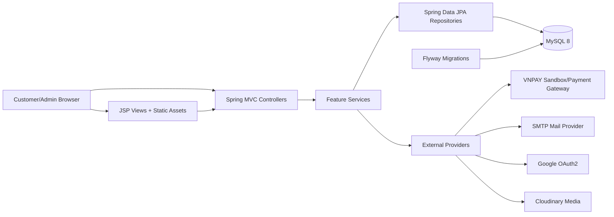
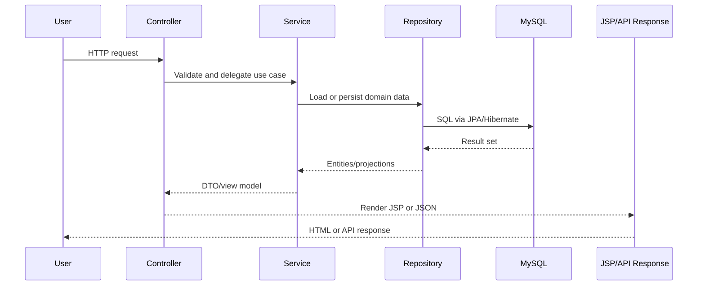
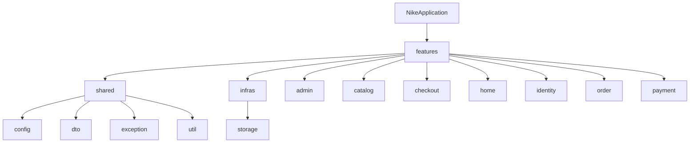

<p align="center">
  
</p>

# Nike E-commerce Web Application

[](https://www.oracle.com/java/)
[](https://spring.io/projects/spring-boot)
[](https://www.mysql.com/)
[](https://maven.apache.org/)
[](https://jakarta.ee/specifications/tags/)
[](LICENSE)

A production-minded Spring Boot e-commerce application for a Nike-style footwear storefront. The project combines a server-rendered customer experience, an admin back office, MySQL persistence, payment integration hooks, Cloudinary-backed media configuration, email delivery, OAuth2 login support, and operational endpoints for health and metrics.

> Brand note: Nike names, marks, and product references belong to Nike, Inc. This repository is a learning and portfolio project. Replace branded assets and naming before public commercial use unless you have the required rights.

## Introduction

Nike E-commerce Web Application is built as a full-stack Java web application using Spring Boot, Spring MVC, JSP/JSTL, Spring Security, Spring Data JPA, Flyway, and MySQL. It models the core flows of a commerce platform:

- Product discovery through home, listing, detail, category, and search pages
- Variant-aware catalog management with colors, sizes, images, stock, and publish state
- Cart, checkout, order, and payment flows
- Customer identity with local authentication, OAuth2 support, profile data, and addresses
- Admin workflows for dashboard data, categories, products, inventory, and orders
- Deployment-oriented configuration through profiles, Docker, environment variables, Actuator, and Prometheus metrics

The codebase follows a package-by-feature structure so each domain owns its controllers, DTOs, entities, repositories, services, and exceptions as much as possible.

## Key Features

### Customer Storefront

- Server-rendered JSP pages for home, catalog, product detail, cart, checkout, order, profile, and authentication flows
- Product search and filtering APIs
- Product detail views with color, size, image, and variant inventory selection
- Cart item add, update, remove, count, and summary behavior
- Checkout initiation and placement flow
- COD and VNPAY-oriented payment handling

### Admin Back Office

- Admin dashboard data endpoints
- Product inventory list and product form data
- Product creation and editing with categories, colorways, variants, stock, and images
- Category management endpoints
- Order list and order management pages
- DTO-based request and response boundaries for admin APIs

### Identity and Security

- Spring Security integration
- Role-based access between customer and admin areas
- Local signup/login flow
- Signup verification and email service integration
- Google OAuth2 client configuration
- JWT/resource-server dependencies for token-oriented security evolution
- CSRF-aware frontend runtime bootstrap

### Platform and Operations

- MySQL 8 persistence with Spring Data JPA
- Flyway migrations in `src/main/resources/db/migration`
- Dockerfile and Docker Compose support
- Environment-specific Spring profiles: `local`, `docker`, `prod`, and `bootstrap`
- Cloudinary configuration for product media storage
- Spring Boot Actuator with health, metrics, and Prometheus endpoints
- WAR packaging as `target/nike-starter.war`

## Overall Architecture

The application is a modular monolith. It keeps deployment simple while separating business capabilities by package and layer.



### Request Flow



### Package Boundaries



## Installation

### Prerequisites

Install the following before running the project:

- Java 17
- Maven 3.6 or newer
- Docker Desktop, or a local MySQL 8 server
- Git

Verify your Java and Maven versions:

```bash
java -version
mvn -version
```

### Clone the Repository

```bash
git clone https://github.com/supaFrik/Nike-e-commerce-web-application.git
cd "Nike Ecommerce Web Application"
```

### Configure Environment Variables

Copy the example environment file and fill in local values:

```bash
cp .env.example .env
```

On Windows PowerShell:

```powershell
Copy-Item .env.example .env
```

Do not commit real credentials. If any secret was previously committed, rotate it before using the application in a real environment.

## Running the Project

### Option 1: Run with Docker Compose

This starts MySQL and the Spring Boot application together.

```bash
docker compose up -d --build
```

By default, Compose maps the application to:

```text
http://localhost:8080
```

To view container status:

```bash
docker compose ps
```

To stop the stack:

```bash
docker compose down
```

### Option 2: Run MySQL with Docker and the App with Maven

Start MySQL:

```bash
docker compose up -d mysql-db
```

Run the application with the local profile:

```bash
mvn spring-boot:run -Dspring-boot.run.profiles=local
```

The application starts at:

```text
http://localhost:9090
```

### Option 3: Build a WAR Artifact

Compile and package:

```bash
mvn clean package
```

Skip tests when you only need a deployable artifact:

```bash
mvn clean package -DskipTests
```

The generated artifact is:

```text
target/nike-starter.war
```

### Useful Development Commands

```bash
mvn clean compile
mvn test
mvn spring-boot:run -Dspring-boot.run.profiles=local
mvn clean package -DskipTests
docker compose up -d
docker compose logs -f app
```

### Common URLs

| Area | URL |
| --- | --- |
| Storefront | `http://localhost:9090` |
| Admin area | `http://localhost:9090/admin` |
| Health check | `http://localhost:9090/actuator/health` |
| Prometheus metrics | `http://localhost:9090/actuator/prometheus` |

When running through Docker Compose, use the configured `APP_PORT` value from `.env`; the default is `8080`.

## Environment Configuration

Spring profiles are used to separate local development, Docker, production, and database bootstrap behavior.

| Profile | File | Purpose |
| --- | --- | --- |
| `local` | `application-local.properties` | Local Maven development |
| `docker` | `application-docker.properties` | Docker Compose or containerized app runtime |
| `prod` | `application-prod.properties` | Production-style deployments behind a proxy/load balancer |
| `bootstrap` | `application-bootstrap.properties` | First-run bootstrap behavior for a new environment |

### Core Variables

| Variable | Required | Description | Example |
| --- | --- | --- | --- |
| `SPRING_PROFILES_ACTIVE` | Yes | Active Spring profile | `local`, `docker`, `prod` |
| `PORT` or `APP_PORT` | No | Application port | `9090`, `8080` |
| `MYSQL_URL` | Yes outside `local` defaults | JDBC connection URL | `jdbc:mysql://localhost:3307/nike_store?...` |
| `MYSQLUSER` | Yes | Database username | `nike_app` |
| `MYSQLPASSWORD` | Yes | Database password | `change-me` |
| `JWT_SECRET` | Yes | Secret used for JWT signing/validation | `replace-with-long-random-secret` |

### Payment Variables

| Variable | Description |
| --- | --- |
| `VNPAY_TMN_CODE` | VNPAY terminal/merchant code |
| `VNPAY_HASH_SECRET` | VNPAY hash secret |
| `VNPAY_PAY_URL` | VNPAY payment URL |
| `VNPAY_RETURN_URL` | Browser return URL after payment |
| `VNPAY_IPN_URL` | Server-to-server payment notification URL |
| `VNPAY_API_URL` | VNPAY transaction API URL |

### VNPay Sandbox Test Card

| Field | Value |
|---------|---------|
| `Bank` | NCB |
| `Card Number` | 9704198526191432198 |
| `Card Holder` | NGUYEN VAN A |
| `Issue Date` | 07/15 |
| `OTP` | 123456 |

Development sandbox values should be stored in `.env` or local machine secrets, not hard-coded into source files.

### Mail Variables

| Variable | Description |
| --- | --- |
| `MAIL_HOST` | SMTP host, for example `smtp.gmail.com` |
| `MAIL_PORT` | SMTP port, commonly `587` |
| `MAIL_USERNAME` | SMTP username |
| `MAIL_PASSWORD` | SMTP password or app password |

### OAuth2 Variables

| Variable | Description |
| --- | --- |
| `GOOGLE_CLIENT_ID` | Google OAuth2 client ID |
| `GOOGLE_CLIENT_SECRET` | Google OAuth2 client secret |

### Cloudinary Variables

| Variable | Description |
| --- | --- |
| `CLOUDINARY_URL` | Optional complete Cloudinary URL |
| `CLOUDINARY_CLOUD_NAME` | Cloudinary cloud name |
| `CLOUDINARY_API_KEY` | Cloudinary API key |
| `CLOUDINARY_API_SECRET` | Cloudinary API secret |

### Example PowerShell Session

```powershell
$env:SPRING_PROFILES_ACTIVE = "local"
$env:PORT = "9090"
$env:MYSQL_URL = "jdbc:mysql://localhost:3307/nike_store?useSSL=false&allowPublicKeyRetrieval=true&serverTimezone=UTC"
$env:MYSQLUSER = "nike_app"
$env:MYSQLPASSWORD = "change-me"
$env:JWT_SECRET = "replace-with-a-long-random-secret"
$env:VNPAY_TMN_CODE = ""
$env:VNPAY_HASH_SECRET = ""
$env:MAIL_HOST = "smtp.gmail.com"
$env:MAIL_PORT = "587"
$env:MAIL_USERNAME = ""
$env:MAIL_PASSWORD = ""
$env:CLOUDINARY_CLOUD_NAME = ""
$env:CLOUDINARY_API_KEY = ""
$env:CLOUDINARY_API_SECRET = ""

mvn spring-boot:run -Dspring-boot.run.profiles=local
```

## Folder Structure

```text
.
|-- .github/                         # GitHub and automation-related files
|-- database/                        # Database support files, if any
|-- docs/                            # Project notes, design docs, test plans
|-- src/
|   |-- main/
|   |   |-- java/vn/demo/nike/
|   |   |   |-- NikeApplication.java
|   |   |   |-- features/
|   |   |   |   |-- admin/          # Admin dashboard, categories, products, orders
|   |   |   |   |-- catalog/        # Product, category, search, cart catalog flows
|   |   |   |   |-- checkout/       # Checkout orchestration and page data
|   |   |   |   |-- home/           # Storefront home page
|   |   |   |   |-- identity/       # Auth, OAuth, users, shopper context
|   |   |   |   |-- order/          # Order pages and order domain behavior
|   |   |   |   `-- payment/        # Payment controller/services
|   |   |   |-- infras/
|   |   |   |   `-- storage/        # Storage integrations
|   |   |   `-- shared/             # Shared config, DTOs, exceptions, utilities
|   |   |-- resources/
|   |   |   |-- db/migration/       # Flyway SQL migrations
|   |   |   |-- static/             # CSS, JS, images, fonts, vendor assets
|   |   |   |-- application.properties
|   |   |   |-- application-local.properties
|   |   |   |-- application-docker.properties
|   |   |   |-- application-prod.properties
|   |   |   `-- application-bootstrap.properties
|   |   `-- webapp/WEB-INF/views/
|   |       |-- administrator/      # Admin JSP pages and layouts
|   |       |-- common/             # Shared JSP fragments/pages
|   |       `-- user/               # Customer JSP pages and layouts
|   `-- test/                       # Unit and integration tests
|-- docker-compose.yml
|-- Dockerfile
|-- pom.xml
|-- LICENSE
`-- README.md
```

## Database Migrations

Flyway runs migrations from:

```text
src/main/resources/db/migration
```

Current migrations include:

| Migration | Purpose |
| --- | --- |
| `V1__init_schema.sql` | Initial schema |
| `V2__reconcile_enum_columns_with_hibernate.sql` | Enum column alignment |
| `V3__add_oauth_provider_accounts.sql` | OAuth provider account support |

The application uses `spring.jpa.hibernate.ddl-auto=validate` in the main profiles, which means schema drift should be handled through migrations rather than automatic Hibernate table creation.

## Testing

Run the full test suite:

```bash
mvn test
```

Run a targeted test class:

```bash
mvn -Dtest=AdminProductServiceTest test
```

Recommended checks before opening a pull request:

```bash
mvn clean compile
mvn test
mvn clean package -DskipTests
```

## Contribution Guidelines

Contributions should keep the project maintainable, secure, and easy to review.

1. Create a focused branch:

   ```bash
   git checkout -b feature/product-filter-sort
   ```

2. Keep each pull request scoped to one concern.
3. Follow the existing package-by-feature structure.
4. Use DTOs at web/API boundaries; do not expose JPA entities directly.
5. Keep business rules inside services, not JSPs or controllers.
6. Add or update tests when changing behavior.
7. Use Flyway migrations for database schema changes.
8. Do not commit secrets, real payment credentials, local passwords, generated build output, or IDE-only files.
9. Document meaningful architectural or workflow changes in `docs/`.

### Commit Style

Use clear, imperative commit messages:

```text
feat: add product search filters
fix: preserve selected variant during cart update
docs: rewrite project setup guide
refactor: isolate checkout payment handler
```

### Pull Request Checklist

- [ ] The app compiles with `mvn clean compile`
- [ ] Relevant tests pass with `mvn test`
- [ ] New environment variables are documented
- [ ] Database changes include Flyway migrations
- [ ] Sensitive values are not committed
- [ ] UI changes are verified in both customer and admin flows, when applicable

## License

This project is licensed under the [MIT License](LICENSE).

The MIT license covers the source code in this repository. It does not grant rights to Nike trademarks, logos, product images, or other third-party brand assets.

## Roadmap

### Near Term

- Expand automated test coverage for checkout, payment, inventory, security, and order flows
- Remove remaining inline scripts from JSP pages and continue consolidating frontend behavior into static JS modules
- Move all local secrets to environment variables and rotate any credentials that were committed during development
- Harden profile-specific configuration for local, Docker, bootstrap, and production usage
- Add seed/demo data workflow for local development
- Guest shopper context and authenticated customer context support

### Platform Improvements

- Add CI checks for compile, tests, formatting, and migration validation
- Document deployment playbooks for Docker VPS and cloud platforms
- Improve observability with structured logging and production dashboards
- Add backup and restore documentation for MySQL and product media
- Add OpenAPI documentation for JSON endpoints

### Product Improvements

- Improve checkout resilience for payment retries and failed payment states
- Add richer order tracking and admin order lifecycle controls
- Add promotion, discount, and coupon support
- Add wishlist and saved cart capabilities
- Add audit logging for admin product and inventory changes

## Additional Documentation

Project documentation lives in [`docs/`](docs).
