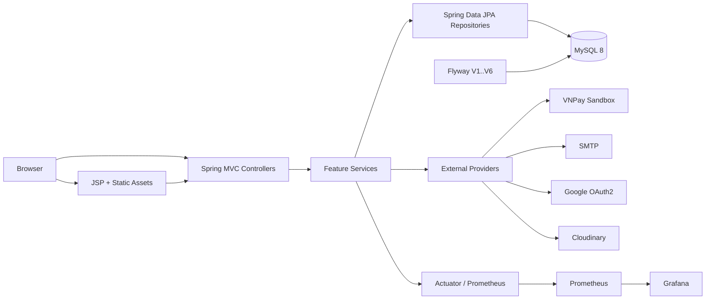
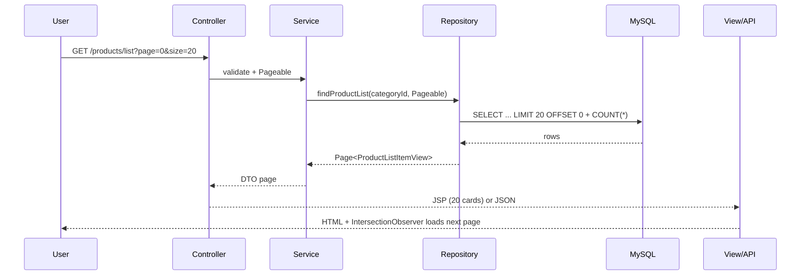
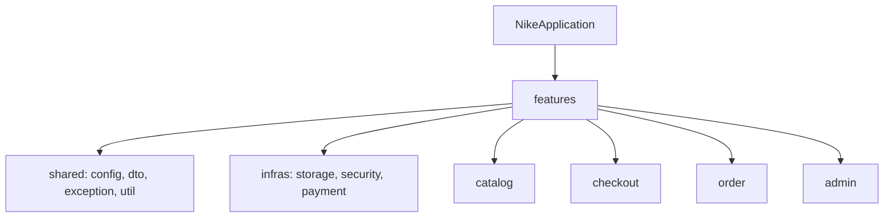

<p align="center">
  
</p>

# Nike E-Commerce Web Application

[](https://www.oracle.com/java/)
[](https://spring.io/projects/spring-boot)
[](https://www.mysql.com/)
[](https://maven.apache.org/)
[](https://jakarta.ee/specifications/tags/)
[](LICENSE)

> **A modular Spring Boot storefront** - server-rendered JSP customer experience + admin back office, MySQL + JPA + Flyway, JWT/OAuth2, VNPay, Cloudinary, and Docker-ready. Built to learn real e-commerce flows, not to demo a toy.

> **Brand note:** Nike names/marks belong to Nike, Inc. This is a portfolio/learning project. Replace branded assets before any commercial use.

---

## Table of Contents
- [Introduction](#introduction)
- [Features](#features)
- [Architecture](#architecture)
- [Installation](#installation)
- [Running the Project](#running-the-project)
- [Env Configuration](#env-configuration)
- [Folder Structure](#folder-structure)
- [Contributing](#contributing)
- [License](#license)
- [Roadmap](#roadmap)

---

## Introduction

Nike E-Commerce is a **full-stack, modular monolith** built with Spring Boot 3.2, Spring MVC, Spring Security, Spring Data JPA (Hibernate), Flyway, MySQL 8 and JSP/JSTL.

It models the core commerce loop end-to-end:

**Discovery -> Variant selection -> Cart -> Checkout -> Order -> Payment -> Admin operations**

The codebase is **package-by-feature** - each domain owns its controllers, DTOs, entities, repositories, services and exceptions. Shared cross-cutting concerns live in `shared/`, infrastructure integrations in `infras/`.

## Features

### Storefront
- Home, category listing, product detail, search, cart, checkout, order detail, profile, etc - all server-rendered JSP
- Cart add/update/remove/count/summary (user-scoped)
- Checkout with address selection, shipping method, COD / VNPay sandbox

### Admin Back Office
- Dashboard metrics, product list & form (colors/variants/images/stock), category CRUD, order list & management
- DTO-bounded admin APIs under `/admin/api/**`

### Identity & Security
- Spring Security, role-based `CUSTOMER` / `ADMIN`, form login + JWT resource server, Google OAuth2, signup verification via email

### Platform & Observability
- MySQL 8 + JPA (validate mode) + Flyway (`V1..V6`)
- Profiles: `local` (Maven, 9090), `docker` (Compose, 8080), `prod` - env-driven
- Optional observability: **Actuator** (`health,info,metrics,prometheus`), **Prometheus** scraping `app:8080/actuator/prometheus` + `mysqld-exporter`, **Grafana** (3001), **k6** smoke/load/stress for `/products/list`
- WAR packaging (`mvn clean package` -> `target/*.war`), Dockerfile + Compose

## Architecture

### High-level


```mermaid
flowchart LR
  U[Browser] --> JSP[JSP + Static Assets]
  U --> C[Spring MVC Controllers]
  JSP --> C
  C --> S[Feature Services]
  S --> R[Spring Data JPA Repositories]
  R --> DB[(MySQL 8)]
  Flyway[Flyway V1..V6] --> DB
  S --> Ext[External Providers]
  Ext --> VNPay[VNPay Sandbox]
  Ext --> Mail[SMTP]
  Ext --> OAuth[Google OAuth2]
  Ext --> Cloudinary[Cloudinary]
  S --> Actuator[Actuator / Prometheus]
  Actuator --> Prometheus[Prometheus]
  Prometheus --> Grafana[Grafana]
```

### Request flow


```mermaid
sequenceDiagram
  participant U as User
  participant C as Controller
  participant S as Service
  participant R as Repository
  participant D as MySQL
  participant V as View/API
  U->>C: GET /products/list?page=0&size=20
  C->>S: validate + Pageable
  S->>R: findProductList(categoryId, Pageable)
  R->>D: SELECT ... LIMIT 20 OFFSET 0 + COUNT(*)
  D-->>R: rows
  R-->>S: Page<ProductListItemView>
  S-->>C: DTO page
  C-->>V: JSP (20 cards) or JSON
  V-->>U: HTML + IntersectionObserver loads next page
```

### Module boundaries


```mermaid
flowchart TB
  App[NikeApplication]
  Features[features]
  Shared[shared: config, dto, exception, util]
  Infra[infras: storage, security, payment]
  App --> Features
  Features --> Shared
  Features --> Infra
  Features --> Catalog[catalog]
  Features --> Checkout[checkout]
  Features --> Order[order]
  Features --> Admin[admin]
```

## Installation

### Prerequisites
- **Java 17**, **Maven 3.9+**, **Docker Desktop** (or local MySQL 8), **Git**
```bash
java -version
mvn -version
docker --version
```

### Clone
```bash
git clone https://github.com/supaFrik/Nike-e-commerce-web-application.git
cd "Nike Ecommerce Web Application"
```

### Env file
```bash
cp .env.example .env   # Windows: Copy-Item .env.example .env
# edit .env - never commit real secrets
```

## Running the Project

### 1) Docker (recommended)
```bash
docker compose up -d --build
docker compose ps
# app: http://localhost:8080
# observability: docker compose -f docker/monitoring.yml up -d
docker compose logs -f app
docker compose down
```

### 2) Local Maven + Docker MySQL
```bash
docker compose up -d mysql-db
mvn spring-boot:run -Dspring-boot.run.profiles=local
# http://localhost:9090
```

### 3) WAR
```bash
mvn clean package
```

### Performance tests
```bash
powershell -ExecutionPolicy Bypass -File k6/run-k6.ps1 -Type smoke
```

| Area | Local (9090) | Docker (8080) |
|---|---|---|
| Storefront | http://localhost:9090 | http://localhost:8080 |
| Health | /actuator/health | /actuator/health |
| Prometheus | /actuator/prometheus | /actuator/prometheus |
| Grafana | - | http://localhost:3001 |

## Env Configuration

| Variable | Required | Example |
|---|---|---|
| `SPRING_PROFILES_ACTIVE` | yes | `local` / `docker` / `prod` |
| `PORT` / `APP_PORT` | no | `9090` / `8080` |
| `MYSQL_URL` | yes | `jdbc:mysql://mysql-db:3306/nike_store?...` |
| `MYSQL_USER` / `MYSQL_PASSWORD` | yes | `nike_app` / `***` |
| `JWT_SECRET` | yes | long random string |

See `.env.example` for VNPay, Mail, OAuth2, Cloudinary vars.

## Folder Structure

```text
src/main/java/vn/demo/nike/
  NikeApplication.java
  features/            # dashboard, products, categories, orders, admin, etc
  infras/              # storage, security
  shared/              # config, dto, exception, util
src/main/resources/
  db/migration/        # Flyway migration
  static/              # css/, js/customer|admin/, images/
  application*.properties
src/main/webapp/WEB-INF/views/
  user/                # User storefront
  administrator/       # Admin storefront
  common/              # fragments, variables.jsp
docker/                # monitoring.yml, prometheus/, grafana/, mysql-exporter/
k6/                    # smoke/, load/, stress/ 
```

## Contributing

1. Branch: `git checkout -b feature/product-list-pagination`
2. One concern per PR
3. Package-by-feature; logic in services, not JSPs/controllers
4. DTOs at boundaries - never expose JPA entities
5. DB changes -> Flyway migration
6. Never commit secrets, `target/`, IDE files

**PR checklist:** `mvn clean compile` / `mvn test` passes, env vars documented, no secrets.

## License

[MIT](LICENSE) - Nike trademarks not licensed.

## Roadmap

- Expand test coverage (checkout, payment, security)
- CI (compile + tests + Flyway validate)
- Checkout resilience, promotions/coupons, wishlist

---
*Docs: `docs/` | Health: `/actuator/health` | Metrics: `/actuator/prometheus`*
