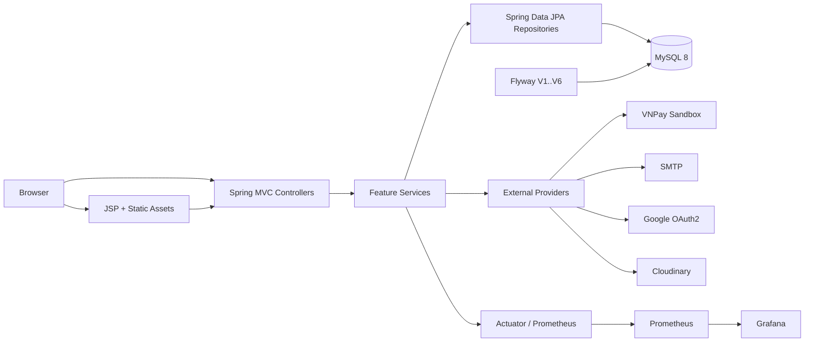
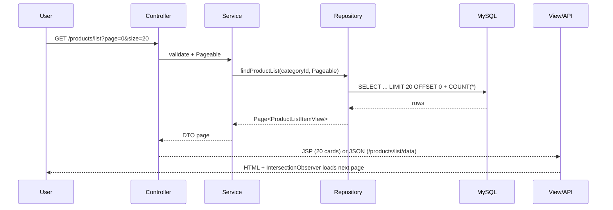
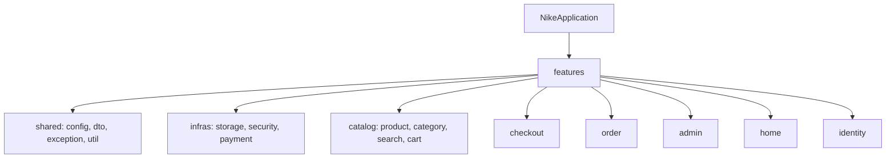
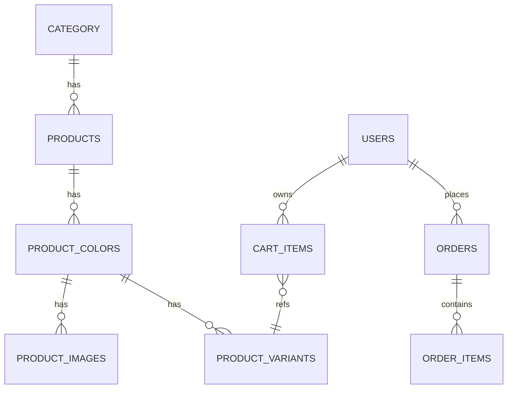

<p align="center">
  
</p>

# Nike E-Commerce Web Application

[](https://www.oracle.com/java/)
[](https://spring.io/projects/spring-boot)
[](https://www.mysql.com/)
[](https://maven.apache.org/)
[](https://jakarta.ee/specifications/tags/)
[](LICENSE)

> **A modular Spring Boot storefront** — server-rendered JSP customer experience + admin back office, MySQL + JPA + Flyway, JWT/OAuth2, VNPay, Cloudinary, and Docker-ready. Built to learn real e-commerce flows, not to demo a toy.

> **Brand note:** Nike names/marks belong to Nike, Inc. This is a portfolio/learning project. Replace branded assets before any commercial use.

---

## Table of Contents
- [Introduction](#introduction)
- [Features](#features)
- [Architecture](#architecture)
- [Installation](#installation)
- [Running the Project](#running-the-project)
- [Env Configuration](#env-configuration)
- [Folder Structure](#folder-structure)
- [Contributing](#contributing)
- [License](#license)
- [Roadmap](#roadmap)

---

## Introduction

Nike E-Commerce is a **full-stack, modular monolith** built with Spring Boot 3.2, Spring MVC, Spring Security, Spring Data JPA (Hibernate), Flyway, MySQL 8 and JSP/JSTL.

It models the core commerce loop end-to-end:

**Discovery ? Variant selection ? Cart ? Checkout ? Order ? Payment ? Admin operations**

The codebase is **package-by-feature** — each domain (`catalog`, `identity`, `checkout`, `order`, `admin`) owns its controllers, DTOs, entities, repositories, services and exceptions. Shared cross-cutting concerns live in `shared/`, infrastructure integrations in `infras/`.

**What this project is good for:** learning how a real storefront is wired (auth, catalog, inventory, orders, payments) without the complexity of microservices.

**What it is not:** a Nike-affiliated product, nor a microservices reference.

## Features

### Storefront
- Home, category listing, product detail, search, cart, checkout, order detail, profile, etc — all server-rendered JSP
- Variant-aware catalog: `Product ? ProductColor ? ProductImage / ProductVariant (size, SKU, stock, inventory_status)`
- Cart add/update/remove/count/summary (user-scoped)
- Checkout with address selection, shipping method, COD / VNPay sandbox

### Admin Back Office
- Dashboard metrics, product list & form (colors/variants/images/stock), category CRUD, order list & management
- DTO-bounded admin APIs under `/admin/api/**`

### Identity & Security
- Spring Security, role-based `CUSTOMER` / `ADMIN`, form login + JWT resource server, Google OAuth2, signup verification via email
- BCrypt passwords, CSRF-aware frontend bootstrap

### Platform & Observability
- MySQL 8 + JPA (validate mode) + Flyway
- Profiles: `local` (Maven, 9090), `docker` (Compose, 8080), `prod` — env-driven
- Optional observability stack (Docker): **Actuator** (`health,info,metrics,prometheus`), **Prometheus** scraping `app:8080/actuator/prometheus` + `mysqld-exporter`, **Grafana** (3001) with provisioned datasource, **k6** smoke/load/stress for `/products/list`
- WAR packaging (`mvn clean package` ? `target/*.war`), Dockerfile + Compose

## Architecture

### High-level


```mermaid
flowchart LR
  U[Browser] --> JSP[JSP + Static Assets]
  U --> C[Spring MVC Controllers]
  JSP --> C
  C --> S[Feature Services]
  S --> R[Spring Data JPA Repositories]
  R --> DB[(MySQL 8)]
  Flyway[Flyway V1..V6] --> DB
  S --> Ext[External Providers]
  Ext --> VNPay[VNPay Sandbox]
  Ext --> Mail[SMTP]
  Ext --> OAuth[Google OAuth2]
  Ext --> Cloudinary[Cloudinary]
  S --> Actuator[Actuator / Prometheus]
  Actuator --> Prometheus[Prometheus]
  Prometheus --> Grafana[Grafana]
```

### Request flow


```mermaid
sequenceDiagram
  participant U as User
  participant C as Controller
  participant S as Service
  participant R as Repository
  participant D as MySQL
  participant V as View/API
  U->>C: GET /products/list?page=0&size=20
  C->>S: validate + Pageable
  S->>R: findProductList(categoryId, Pageable)
  R->>D: SELECT ... LIMIT 20 OFFSET 0 + COUNT(*)
  D-->>R: rows
  R-->>S: Page<ProductListItemView>
  S-->>C: DTO page
  C-->>V: JSP (20 cards) or JSON (/products/list/data)
  V-->>U: HTML + IntersectionObserver loads next page
```

### Module boundaries


```mermaid
flowchart TB
  App[NikeApplication]
  Features[features]
  Shared[shared: config, dto, exception, util]
  Infra[infras: storage, security, payment]

  App --> Features
  Features --> Shared
  Features --> Infra
  Features --> Catalog[catalog: product, category, search, cart]
  Features --> Checkout[checkout]
  Features --> Order[order]
  Features --> Admin[admin]
  Features --> Home[home]
  Features --> Identity[identity]
```

**Data model (simplified):**


```mermaid
erDiagram
  CATEGORY ||--o{ PRODUCTS : has
  PRODUCTS ||--o{ PRODUCT_COLORS : has
  PRODUCT_COLORS ||--o{ PRODUCT_IMAGES : has
  PRODUCT_COLORS ||--o{ PRODUCT_VARIANTS : has
  USERS ||--o{ CART_ITEMS : owns
  CART_ITEMS }o--|| PRODUCT_VARIANTS : refs
  USERS ||--o{ ORDERS : places
  ORDERS ||--o{ ORDER_ITEMS : contains
```

## Installation

### Prerequisites
- **Java 17**, **Maven 3.9+**, **Docker Desktop** (or local MySQL 8), **Git**
```bash
java -version
mvn -version
docker --version
```

### Clone
```bash
git clone https://github.com/supaFrik/Nike-e-commerce-web-application.git
cd "Nike Ecommerce Web Application"
```

### Env file
```bash
cp .env.example .env   # Windows: Copy-Item .env.example .env
# edit .env — never commit real secrets
```

## Running the Project

### 1) Docker (recommended) — app + MySQL + optional observability
```bash
docker compose up -d --build
docker compose ps
# app: http://localhost:8080 (APP_PORT in .env)
# observability: docker compose -f docker/monitoring.yml up -d  # prometheus 9090, grafana 3001, mysql-exporter 9104
docker compose logs -f app
docker compose down
```

### 2) Local Maven + Docker MySQL
```bash
docker compose up -d mysql-db
mvn spring-boot:run -Dspring-boot.run.profiles=local
# http://localhost:9090
```

### 3) WAR
```bash
mvn clean package          # target/*.war
mvn clean package -DskipTests
```

### Performance tests (local Docker)
```bash
# smoke / load / stress currently only for /products/list?categoryId=3&sort=newest
powershell -ExecutionPolicy Bypass -File k6/run-k6.ps1 -Type smoke
docker compose -f k6/k6-testing.yml run --rm k6 run -o experimental-prometheus-rw /scripts/load/product-list.js
```

### Baseline URLs

| Area | Local (`9090`) | Docker (`8080`) |
|---|---|---|
| Storefront | http://localhost:9090 | http://localhost:8080 |
| Admin | http://localhost:9090/admin | http://localhost:8080/admin |
| Product list | /products/list?page=0&size=20 | /products/list?page=0&size=20 |
| Health | /actuator/health | /actuator/health |
| Prometheus | /actuator/prometheus | /actuator/prometheus |
| Grafana | — | http://localhost:3001 |
| Prometheus UI | — | http://localhost:9090 |

## Env Configuration

Profiles: `local` ? `application-local.properties`, `docker` ? `application-docker.properties`, `prod` ? `application-prod.properties`. `application.properties` holds defaults.

**Core**

| Variable | Required | Example |
|---|---|---|
| `SPRING_PROFILES_ACTIVE` | yes | `local` / `docker` / `prod` |
| `PORT` / `APP_PORT` | no | `9090` (local) `8080` (docker) |
| `MYSQL_URL` | yes (except local) | `jdbc:mysql://mysql-db:3306/nike_store?useSSL=false&allowPublicKeyRetrieval=true&serverTimezone=UTC` |
| `MYSQL_USER` / `MYSQL_PASSWORD` | yes | `nike_app` / `***` |
| `MYSQL_ROOT_PASSWORD` | yes (docker) | `***` |
| `JWT_SECRET` | yes | long random string |

**Payments (VNPay sandbox)**

| Variable | Purpose |
|---|---|
| `VNPAY_TMN_CODE`, `VNPAY_HASH_SECRET`, `VNPAY_PAY_URL`, `VNPAY_RETURN_URL`, `VNPAY_IPN_URL`, `VNPAY_API_URL` | Sandbox gateway |

**Mail / OAuth / Media**

| Variable | Purpose                        |
|---|--------------------------------|
| `MAIL_HOST`, `MAIL_PORT`, `MAIL_USERNAME`, `MAIL_PASSWORD` | SMTP (e.g. smtp.gmail.com:587) |
| `GOOGLE_CLIENT_ID`, `GOOGLE_CLIENT_SECRET` | OAuth2                         |
| `CLOUDINARY_CLOUD_NAME`, `CLOUDINARY_API_KEY`, `CLOUDINARY_API_SECRET` | Cloud Image                    |

**Example — PowerShell local run:**
```powershell
$env:SPRING_PROFILES_ACTIVE="local"; $env:PORT="9090"
$env:MYSQL_URL="jdbc:mysql://localhost:3307/nike_store?useSSL=false&allowPublicKeyRetrieval=true&serverTimezone=UTC"
$env:MYSQL_USER="nike_app"; $env:MYSQL_PASSWORD="your-root-password"; $env:JWT_SECRET="your-jwt-secret"
mvn spring-boot:run -Dspring-boot.run.profiles=local
```

> Keep secrets in `.env` / host env, never in Git. Rotate any credential that was once committed.

## Folder Structure

```text
.
+-- docker/                 # monitoring.yml, prometheus/, grafana/, mysql-exporter/
+-- k6/                     # smoke/, load/, stress/ (k6 scripts) + run-k6.ps1
+-- docs/                   # performance test plans, technical notes
+-- src/
¦   +-- main/
¦   ¦   +-- java/vn/demo/nike/
¦   ¦   ¦   +-- NikeApplication.java
¦   ¦   ¦   +-- features/
¦   ¦   ¦   +-- infras/           # storage (Cloudinary), security (JWT/OAuth)
¦   ¦   ¦   +-- shared/           # config, dto, exception, util
¦   ¦   +-- resources/
¦   ¦   ¦   +-- db/migration/     # Flyway migration
¦   ¦   ¦   +-- static/           # css/, js/customer|admin/, images/, fonts/
¦   ¦   ¦   +-- application*.properties
¦   ¦   ¦   +-- administrator/    # admin theme assets
¦   ¦   +-- webapp/WEB-INF/views/
¦   ¦       +-- administrator/    # admin JSP layouts
¦   ¦       +-- common/           # fragments, variables.jsp (env = contextPath)
¦   ¦       +-- user/             # storefront JSP (product-list.jsp: pagination 20 + infinite scroll via IntersectionObserver ? /products/list/data)
¦   +-- test/                     # unit tests
+-- docker-compose.yml            # app + mysql-db (nike-network)
+-- Dockerfile
+-- pom.xml                       # Spring Boot 3.2.4, Java 17, WAR
+-- .env.example
```

## Contributing

Keep it boring, reviewable, and secure.

1. Branch: `git checkout -b feature/product-list-pagination`
2. One concern per PR — no drive-by refactors
3. Respect package-by-feature; keep business logic in services, not JSPs/controllers
4. Web/API boundaries use DTOs — never expose JPA entities
5. DB changes ? Flyway migration under `db/migration/`
6. Add/update tests with behavior changes
7. Never commit secrets, `.env`, `target/`, or IDE files

**Commit style:** `feat:`, `fix:`, `docs:`, `refactor:` (imperative)

**PR checklist:**
- [ ] `mvn clean compile` / `mvn test` passes
- [ ] New env vars documented
- [ ] Flyway migration included if schema changed
- [ ] No secrets committed
- [ ] UI verified for storefront + admin where applicable

## License

[MIT](LICENSE) — covers source code. Nike trademarks, logos, and product imagery are not licensed.

## Roadmap

**Near term** — correctness & hygiene
- [ ] Expand test coverage (checkout, payment, inventory, security)

**Platform**
- [ ] CI (compile + tests + Flyway validate) — GitHub Actions
- [ ] Structured logging + Grafana dashboards for `http.server.requests`, Hikari, JVM, Tomcat (Actuator already exposed)
- [ ] DB backup/restore docs for MySQL + media

**Product**
- [ ] Checkout resilience (retries, failed-payment states, idempotent VNPay IPN)
- [ ] Richer order tracking & admin lifecycle
- [ ] Promotions/coupons, wishlist, audit log for admin inventory changes

---
*Docs:* [`docs/`](docs) · *Health:* `/actuator/health` · *Metrics:* `/actuator/prometheus`
