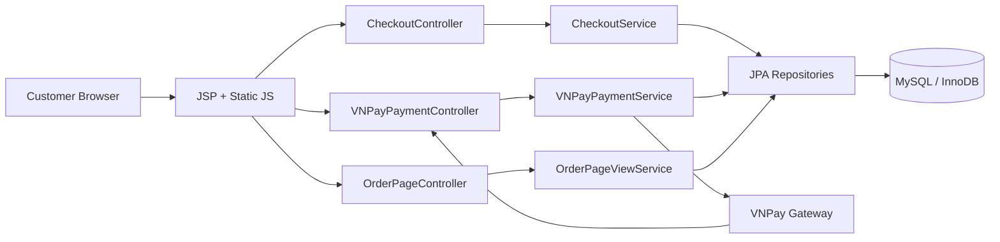
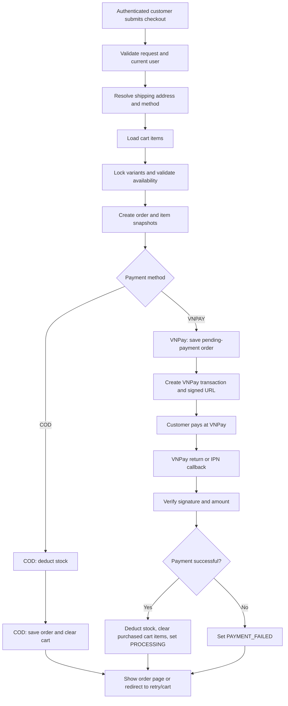
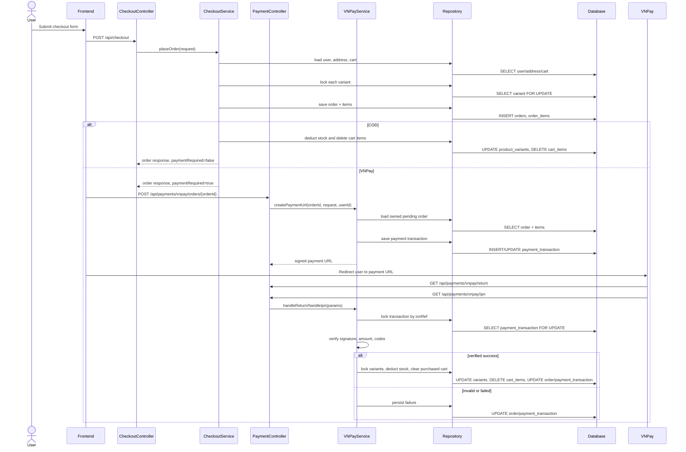
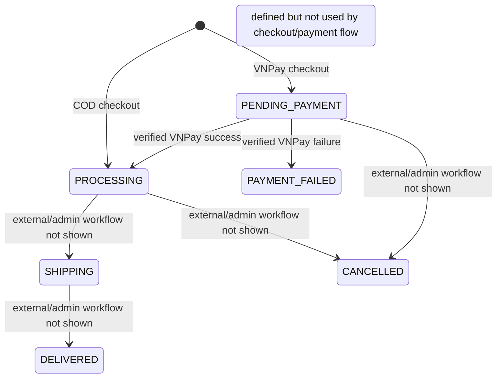
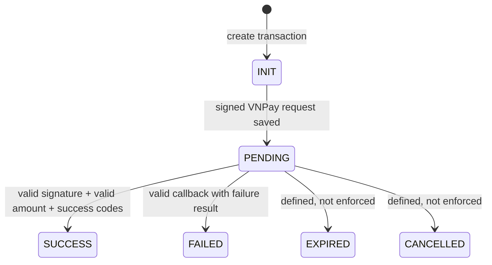
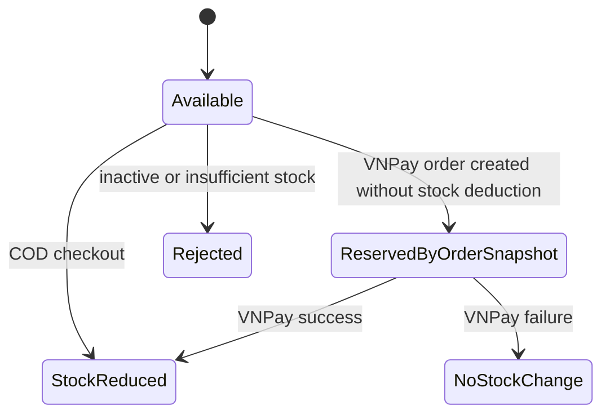

# Checkout, Order Placement, and VNPay Payment Reconciliation

## 1. Executive Summary

**Feature name:** Checkout, Order Placement, and VNPay Payment Reconciliation

**Business purpose:** Convert an authenticated customer's cart into a durable order, collect shipping information, support cash-on-delivery and VNPay online payment, and reconcile gateway callbacks into internal order/payment state.

**Problem being solved:** The system must prevent invalid orders, preserve product and pricing snapshots at checkout time, avoid overselling inventory, and ensure that external payment results are verified before inventory and order state are finalized.

**High-level system impact:** This feature is the boundary between browsing/cart activity and revenue recognition. It writes orders, order items, addresses, payment transactions, inventory changes, and cart cleanup records. It also exposes unauthenticated VNPay callback endpoints, so signature validation and state checks are critical.

## 2. Business Context

**Actors involved**

- Customer: authenticated shopper placing an order.
- Frontend/JSP views: checkout, cart, payment redirect, and order detail pages.
- Spring MVC controllers: checkout, payment, and order page entry points.
- Checkout service: validates cart and creates orders.
- VNPay payment service: creates gateway payment requests and processes returns/IPNs.
- Database: source of truth for orders, cart items, product variants, addresses, and payment transactions.
- VNPay: external payment gateway.

**Business objectives**

- Allow authenticated customers to place orders from their carts.
- Support COD orders without a third-party payment dependency.
- Support VNPay orders with signed gateway redirection and callback verification.
- Prevent orders for inactive, missing, or understocked variants.
- Preserve immutable order item snapshots independent of later catalog changes.
- Keep cart, inventory, order, and payment state consistent.

**User journey**

1. Customer adds product variants to cart.
2. Customer opens checkout.
3. Customer submits shipping details, shipping method, and payment method.
4. System creates an order and order item snapshots.
5. For COD, system deducts stock, clears cart, and moves the order to processing.
6. For VNPay, system creates a pending-payment order, then the customer starts a VNPay payment session.
7. VNPay redirects the browser to the return endpoint and separately calls IPN.
8. A verified successful result finalizes inventory, clears purchased cart items, and moves the order to processing.

**External systems**

- VNPay payment gateway.
- MySQL/InnoDB database.
- Spring Security session authentication.

## 3. Functional Requirements

**Primary capabilities**

- Place checkout orders from the authenticated user's cart.
- Persist shipping address details and copy them into the order.
- Resolve selected shipping method and calculate shipping cost.
- Resolve payment method as `COD` or `VNPAY`.
- Create order item snapshots with product, variant, SKU, color, size, unit price, quantity, and line total.
- Create VNPay payment URLs with signed parameters.
- Process VNPay browser return and server-to-server IPN callbacks.
- Display checkout and order pages using order/cart/payment summaries.

**Validation requirements**

- Checkout request must be non-null.
- Payment method is required and must match a known enum value.
- Shipping method is required by DTO validation and must match a known enum value in service validation.
- Recipient name, phone, line1, city, and country are required.
- Address ID, when supplied, must belong to the current user.
- Cart must not be empty.
- Product variant must exist, be active, and have enough stock.
- Subtotal, discount, and total must not be negative.
- VNPay amount must match the internal transaction amount multiplied by 100.
- VNPay signature must match the HMAC-SHA512 hash generated from signed fields.

**Security requirements**

- Checkout and payment URL creation require an authenticated session.
- Order and payment URL creation are scoped to the current user's order.
- VNPay return and IPN endpoints are public but must validate signatures and transaction state.
- Admin routes are role-protected separately from customer checkout routes.
- Raw gateway data is truncated before audit persistence.

**Operational requirements**

- Gateway configuration must include terminal code, hash secret, pay URL, and return URL.
- Payment transactions must have unique transaction references.
- Callback handling must be idempotent for IPN.
- Database operations that finalize stock or gateway state run inside transactions.

## 4. Business Rules

**BR-001:** A checkout order can only be placed by an authenticated user.

**BR-002:** A checkout request must include payment method, shipping method, recipient name, phone, address line 1, city, and country.

**BR-003:** The payment method must be one of the supported methods: `COD` or `VNPAY`.

**BR-004:** The shipping method must be one of `STANDARD`, `EXPRESS`, or `PICKUP`; invalid values reject checkout.

**BR-005:** If no address ID is provided, the user's primary address is used; if no address exists, a new address is created.

**BR-006:** A submitted address ID must belong to the authenticated user.

**BR-007:** Checkout cannot proceed with an empty cart.

**BR-008:** Each cart item must reference an existing product variant.

**BR-009:** A product variant must be active at checkout time.

**BR-010:** A product variant must have stock greater than or equal to the cart quantity.

**BR-011:** Order item pricing uses the current catalog sale price when present; otherwise it uses the base price.

**BR-012:** Order item data is snapshotted into `order_items` so order history does not depend on future product edits.

**BR-013:** Discount cannot be negative. Current implementation always uses zero discount.

**BR-014:** Total must equal subtotal plus shipping cost minus discount and cannot be negative.

**BR-015:** COD orders start in `PROCESSING`.

**BR-016:** VNPay orders start in `PENDING_PAYMENT`.

**BR-017:** COD checkout deducts stock immediately and clears the whole cart in the same checkout transaction.

**BR-018:** VNPay checkout does not deduct stock or clear cart until a verified successful payment result is processed.

**BR-019:** A VNPay payment URL can only be created for the current user's order.

**BR-020:** A VNPay payment URL can only be created for an order whose payment method is `VNPAY`.

**BR-021:** A VNPay payment URL can only be created while the order is `PENDING_PAYMENT`.

**BR-022:** VNPay payment requests expire 15 minutes after creation, but expiration is currently recorded rather than enforced during callbacks.

**BR-023:** VNPay return and IPN callbacks must have a valid signature before the payment result is trusted.

**BR-024:** VNPay callback amount must match the internal transaction amount.

**BR-025:** VNPay success requires both `vnp_ResponseCode` and `vnp_TransactionStatus` to equal `00`.

**BR-026:** A successful VNPay callback finalizes stock, removes purchased variants from the user's cart, and moves the order to `PROCESSING`.

**BR-027:** A failed VNPay callback marks the payment transaction `FAILED` and the order `PAYMENT_FAILED`.

**BR-028:** IPN processing is idempotent using the `ipnProcessed` flag.

**BR-029:** A duplicate IPN for an already processed transaction returns VNPay response code `02`.

**BR-030:** A callback for a non-existent transaction returns an order-not-found response.

**BR-031:** A callback for a non-VNPay order is rejected as order-not-found from the gateway perspective.

**BR-032:** Payment transaction references must be unique.

**BR-033:** Product variant rows are pessimistically locked before inventory-sensitive validation or deduction.

**BR-034:** Payment transaction rows are pessimistically locked during callback reconciliation.

## 5. High-Level Architecture

The feature is implemented as package-by-feature modules:

- `checkout`: request validation, cart-to-order conversion, address resolution, and payment-method dispatch.
- `payment`: VNPay request generation, signature verification, callback reconciliation, and payment transaction persistence.
- `order`: order/order item entities, customer order page composition, and order ownership checks.
- `catalog/cart`: cart item source data and cart cleanup.
- `catalog/product`: variant inventory source with pessimistic locking.
- `identity/user`: current-user resolution and shipping addresses.
- `shared/config`: Spring Security route protection and global exception handling.

## 6. High-Level Workflow

## 7. Sequence Diagram

## 8. Detailed Flow Analysis

### Happy Path

1. Authenticated customer submits checkout with valid shipping and payment data.
2. Service resolves current user and confirms the shipping address belongs to that user.
3. Cart items are loaded and each referenced variant is locked with `PESSIMISTIC_WRITE`.
4. System validates active status and stock availability.
5. System snapshots product and variant details into order items.
6. System calculates subtotal, shipping cost, discount, and total.
7. For COD, stock is deducted immediately, order is saved as `PROCESSING`, and cart is cleared.
8. For VNPay, order is saved as `PENDING_PAYMENT`.
9. Customer requests a VNPay payment URL for the owned pending order.
10. System creates a unique pending payment transaction and signs VNPay request parameters.
11. VNPay returns success through return/IPN.
12. System verifies signature, amount, and success codes.
13. System locks the payment transaction and product variants, deducts stock, clears purchased cart variants, marks payment `SUCCESS`, and moves the order to `PROCESSING`.

### Failure Path

- Missing checkout fields return `400 Bad Request`.
- Unauthenticated checkout returns an authentication failure path through security/current-user validation.
- Address ownership mismatch returns `400 Bad Request`.
- Empty cart returns `400 Bad Request`.
- Missing, inactive, or understocked variant returns `400 Bad Request`.
- Invalid order/payment state during VNPay URL creation returns `409 Conflict`.
- Invalid VNPay checksum returns gateway response `97` for IPN or redirects the browser to checkout/cart for return.
- Invalid amount returns gateway response `04` for IPN.
- Failed VNPay response codes mark transaction `FAILED` and order `PAYMENT_FAILED`.
- Unexpected infrastructure errors return `500 Internal Server Error`.

### Recovery Path

- Customer can be redirected back to checkout with `orderId` after failed VNPay return.
- Checkout page can reconstruct a summary from an existing order when the cart is empty.
- Payment history is retained through `payment_transaction` rows.
- IPN duplicates return an already-confirmed response instead of reapplying stock deduction.
- There is no automated payment retry orchestration; retry depends on creating another payment transaction for the still-owned pending/failed order path, which is only partially represented in the current UI actions.

## 9. State Transition Analysis

### Order

**States:** `PENDING_PAYMENT`, `PAYMENT_FAILED`, `PROCESSING`, `SHIPPING`, `DELIVERED`, `CANCELLED`, `PAID`.

**Observed transitions**

- `[*] -> PROCESSING` for COD checkout.
- `[*] -> PENDING_PAYMENT` for VNPay checkout.
- `PENDING_PAYMENT -> PROCESSING` after verified VNPay success.
- `PENDING_PAYMENT -> PAYMENT_FAILED` after verified failed VNPay result.

`PAID`, `SHIPPING`, `DELIVERED`, and `CANCELLED` exist in the enum but are not driven by the analyzed checkout/payment services.

### Payment Transaction

**States:** `INIT`, `PENDING`, `SUCCESS`, `FAILED`, `CANCELLED`, `EXPIRED`.

**Observed transitions**

- `INIT -> PENDING` during VNPay URL creation.
- `PENDING -> SUCCESS` after verified successful callback.
- `PENDING -> FAILED` after verified failed callback or valid return failure.

`CANCELLED` and `EXPIRED` are defined but not currently enforced by the payment service.

### Product Variant Inventory

**States:** Active/inactive availability plus numeric stock.

**Allowed transitions**

- Active variant stock decreases on COD checkout.
- Active variant stock decreases on successful VNPay reconciliation.
- Inactive variants and insufficient stock reject checkout/finalization.

## 10. Database Impact

**`addresses`**

- Insert: when the user has no existing address and submits checkout shipping details.
- Update: when an existing user-owned or primary address is used and overwritten with submitted shipping details.
- Delete: none in this flow.

**`orders`**

- Insert: every successful checkout creates an order.
- Update: VNPay callbacks update `order_status` to `PROCESSING` or `PAYMENT_FAILED`.
- Delete: none in this flow.

**`order_items`**

- Insert: created with every order as immutable product/variant snapshots.
- Update: none in this flow.
- Delete: cascades only if an order is deleted outside this flow.

**`payment_transaction`**

- Insert: VNPay payment URL creation creates a transaction.
- Update: transaction moves to `PENDING` during URL creation and later to `SUCCESS` or `FAILED`; gateway metadata and raw response audit fields are stored.
- Delete: none in this flow.

**`product_variants`**

- Update: stock decremented for COD checkout or verified successful VNPay payment.
- Insert/Delete: none in this flow.

**`cart_items`**

- Delete: COD clears all cart items; VNPay success clears purchased variant rows for the user.
- Insert/Update: none in this flow.

**Transaction boundary analysis**

- `CheckoutService.placeOrder` is one transaction covering request validation after entry, address persistence, cart load, variant locks, order creation, COD stock deduction, and COD cart cleanup.
- `VNPayPaymentService.createPaymentUrl` is one transaction covering order ownership/state validation and payment transaction creation/update.
- `VNPayPaymentService.handleReturn` is one transaction covering signature/amount verification, payment transaction locking, and possible order/payment mutation.
- `VNPayPaymentService.handleIpn` is one transaction covering signature/amount verification, payment transaction locking, idempotency check, stock deduction, cart cleanup, and order/payment updates.

## 11. Data Consistency Analysis

**Transaction scope:** Critical write operations are annotated with `@Transactional`, which lets JPA dirty checking persist order, payment, stock, and cart changes atomically per request.

**Locking strategy:** Product variants are locked with `PESSIMISTIC_WRITE` before stock-sensitive validation and deduction. Payment transactions are locked with `PESSIMISTIC_WRITE` during callback reconciliation.

**Concurrency handling:** Variant locks reduce oversell risk when two checkouts attempt to consume the same stock. Transaction locks reduce duplicate callback mutation risk for the same `txnRef`.

**Race condition prevention:** VNPay IPN uses `ipnProcessed` and transaction row locking. However, the browser return handler can also call `applyGatewayResult` and finalize stock before IPN sets `ipnProcessed`, so return/IPN concurrency still deserves scrutiny.

**Idempotency mechanisms:** Unique `txnRef` and `ipnProcessed` provide IPN idempotency. Checkout placement itself is not idempotent; repeated checkout submissions can create multiple orders from the same cart if the first transaction has not cleared it or if VNPay pending orders are created repeatedly.

## 12. Security Analysis

**Authentication:** Checkout and VNPay payment URL creation require authenticated sessions through Spring Security. VNPay return and IPN are explicitly public.

**Authorization:** Order access and payment URL creation are scoped by `orderId` plus current user ID. Admin routes require `ADMIN`.

**Input validation:** DTO bean validation and service-level checks validate required shipping fields, enum values, cart state, and stock. Gateway callbacks validate signature and amount before trusting success.

**Replay protection:** IPN replay is partially handled by `ipnProcessed`. Browser return replay is not explicitly idempotent and can still enter logic if the order remains `PENDING_PAYMENT`.

**Signature verification:** VNPay callback signatures use HMAC-SHA512 over sorted non-signature fields.

**Fraud prevention:** Amount matching prevents client/gateway amount tampering. IP address is stored for audit. There is no velocity/risk scoring, trusted VNPay IP allowlist, or callback timestamp tolerance.

**Sensitive data exposure weaknesses**

- Payment URL is logged at info level, which can expose signed payment URLs.
- Raw callback/request data is persisted, albeit truncated.
- Generic data integrity handler returns database exception messages to clients.
- `VNPaySignatureService.hmacSHA512` returns an empty string on error, which can hide cryptographic failures.

## 13. Scalability Analysis

**Performance bottlenecks**

- Checkout locks variants one by one, which can increase latency for large carts.
- Pessimistic locks serialize purchases of the same variants.
- Order page view performs product image lookups and payment history reads during page rendering.

**Database contention**

- High-demand product variants become hot rows because stock is decremented directly on `product_variants`.
- Payment callback bursts for the same transaction are serialized by transaction row locks.

**Locking impact**

- Locking is appropriate for inventory correctness, but it increases deadlock risk if future flows lock variants in different orders. Variant locks should use deterministic ordering if multi-item orders grow.

**External dependency risks**

- VNPay availability directly affects online payment completion.
- Browser return and IPN may arrive in either order.
- There is no scheduled reconciliation job to recover transactions when callbacks are missed.

**Future scaling concerns**

- Cart-to-order and payment finalization are synchronous.
- There is no reservation TTL for VNPay pending orders.
- Inventory is deducted only after payment, so stock shown to other users can be oversold between order creation and payment success unless finalization rejects late success due to insufficient stock.

## 14. Error Handling Strategy

**Business exceptions**

- Invalid checkout request: returns `400`.
- Invalid order state: returns `409`.
- Invalid payment method: returns `409`.
- Order not found for user: returns `404`.

**Validation failures**

- Bean validation should reject invalid DTOs before service execution.
- Service validation rejects null/blank fields, invalid enums, empty carts, and invalid amounts.

**Infrastructure failures**

- Unexpected exceptions return a generic `500`, but stack traces are printed directly, which is not production-grade logging.
- Data integrity violations return `400` with database details, which should be sanitized.

**External gateway failures**

- Invalid checksum returns VNPay IPN response `97`.
- Missing transaction returns `01`.
- Duplicate or already-confirmed transaction returns `02`.
- Amount mismatch returns `04`.
- Successful confirmation returns `00`.

## 15. Design Review

### Strengths

- Clear package-by-feature organization around checkout, payment, order, cart, and product.
- Controllers are thin; business behavior is centralized in services.
- Order items are snapshotted, preserving historical order integrity.
- Inventory deduction uses pessimistic row locks.
- Payment transaction references are unique.
- VNPay signatures and amounts are verified before success is trusted.
- IPN has explicit idempotency handling.
- Order ownership is checked for customer-facing order/payment operations.

### Weaknesses

- VNPay return handler can mutate order/payment state, creating overlap with IPN responsibilities.
- Payment expiration is stored but not enforced.
- Repeated checkout submissions are not idempotent.
- VNPay pending orders do not reserve inventory, creating late-payment stock failure risk.
- The `PAID` order status exists but the payment flow moves directly to `PROCESSING`, making the state model ambiguous.
- Gateway payment URL is logged.
- Global exception handling exposes raw database error messages.
- Cryptographic errors are swallowed by returning an empty hash.

### Technical Debt

- No reconciliation job for stale `PENDING` or `PENDING_PAYMENT` records.
- No domain-level state machine guarding all order transitions.
- No explicit payment retry model.
- No optimistic version column on order, variant, cart, or transaction entities.
- No durable outbox/event model for post-payment fulfillment actions.

## 16. Refactoring Opportunities

**Priority 1: Separate gateway return from authoritative settlement**

Make IPN the only authoritative state-changing callback. Treat browser return as a read/redirect experience that displays pending/success/failure based on current transaction state.

**Priority 2: Introduce an order/payment state machine**

Centralize allowed transitions for `OrderStatus` and `PaymentStatus`. This prevents accidental transitions such as `PAYMENT_FAILED -> PROCESSING` without an explicit retry.

**Priority 3: Add idempotency keys for checkout and payment creation**

Use a client-generated checkout idempotency key or server checkout session to avoid duplicate orders on repeated submissions.

**Priority 4: Enforce payment expiration**

Reject callbacks after `expireDate` or mark transactions `EXPIRED` via a scheduler/reconciliation job, depending on gateway contract.

**Priority 5: Model inventory reservation**

For online payments, reserve inventory at order creation with a TTL, or keep current late-deduction behavior but explicitly handle success-after-stockout as a compensating failure/refund workflow.

**Priority 6: Improve payment abstraction**

Promote `CheckoutPaymentHandler` into a full payment strategy with create, settle, fail, retry, and audit contracts. COD and VNPay can then share a consistent lifecycle.

**Priority 7: Add domain events**

Emit events such as `OrderPlaced`, `PaymentSucceeded`, `PaymentFailed`, and `InventoryDeducted`. This would support email notifications, fulfillment, analytics, and reconciliation without coupling those concerns to checkout.

## 17. Production Readiness Assessment

**Reliability: Medium**

The core transaction and locking choices are sound, but missing reconciliation, expiration enforcement, and return/IPN responsibility separation reduce operational reliability.

**Security: Medium**

Authentication, ownership checks, and VNPay signature validation are present. Production risks remain around payment URL logging, public callback hardening, database error exposure, and swallowed crypto failures.

**Maintainability: Medium-High**

The feature boundaries are understandable and controllers are clean. Maintainability would improve with explicit state machines, payment strategies, and reduced duplicate callback behavior.

**Scalability: Medium**

The current design is acceptable for moderate traffic. Variant-level pessimistic locking and synchronous payment finalization will become pressure points under high-volume flash-sale conditions.

## 18. Summary

The feature converts authenticated customer carts into durable orders and supports two payment paths: COD, which finalizes inventory immediately, and VNPay, which creates a pending order and finalizes only after signed gateway confirmation.

The critical business rules are authentication, address ownership, non-empty cart, active and sufficiently stocked variants, immutable order snapshots, verified VNPay signatures, amount matching, and state-restricted payment reconciliation.

Architecturally, the strongest decisions are transaction-scoped order creation, pessimistic inventory locks, transaction reference uniqueness, and signed callback validation. The main production concerns are callback authority overlap, missing idempotent checkout, lack of payment expiration enforcement, insufficient stale-payment recovery, and ambiguity in order/payment state transitions.
