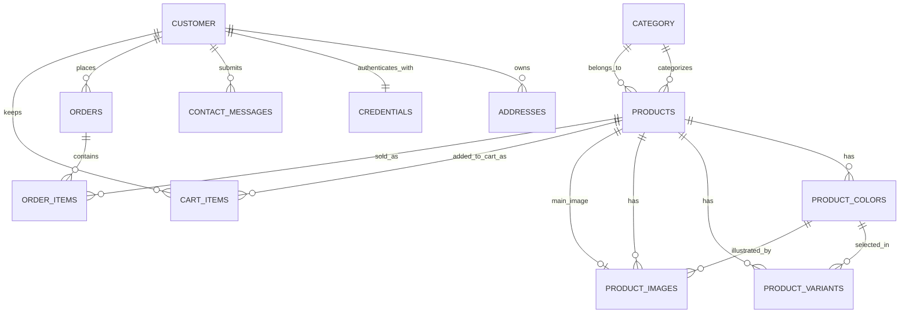

# Domain Model and Database Map

## Why this doc exists

This project already has a lot of code, but the data model is spread across entities, repositories, services, controllers, and an in-progress package refactor. This document crystalizes the actual domain model that the source code currently describes.

It is based on static analysis of:

- `src/main/java/vn/demo/nike/domain/**`
- `src/main/java/vn/demo/nike/admin/**`
- `src/main/resources/application.properties`
- `pom.xml`
- `src/test/java/vn/demo/nike/**`

## Executive summary

This is a Spring Boot MVC e-commerce application centered on four real business domains:

1. Catalog: categories, products, colors, variants, images
2. Identity: customers, credentials, addresses
3. Purchase flow: cart items, orders, order items
4. Contact: feedback/contact messages

From a database perspective, `Product` is the main aggregate root for catalog data, `Customer` is the main aggregate root for account data, and `Order` is the snapshot root for completed purchases.

Important: the effective schema is currently driven mostly by JPA entity mappings plus `spring.jpa.hibernate.ddl-auto=update`. Flyway is enabled in config, but no migration files were found under `src/main/resources/db/migration`.

## What the project is, structurally

### Runtime shape

- Framework: Spring Boot 2.7.x
- UI: JSP + Spring MVC
- Persistence: Spring Data JPA + Hibernate
- Database target: MySQL 8
- Security: Spring Security with email/password login
- Packaging: WAR

### Actual code organization state

There is an in-progress namespace refactor:

- Files are physically under `src/main/java/vn/demo/nike/...`
- Most Java files declare package `vn.devpro.javaweb32...`

So the logical package name and the folder name currently do not match.

## Source of truth for the schema

When this repo talks about the database, the most trustworthy artifacts are the entity classes:

- `domain/customer/entity/*`
- `domain/product/entity/*`
- `domain/cart/entity/*`
- `domain/order/entity/*`
- `domain/base/entity/BaseEntity.java`

The README contains broader claims like wishlist/reviews/contact-info tables, but the current code only clearly implements the entities documented below.

## Domain boundaries

### 1. Catalog domain

Purpose:

- organize products into categories
- represent product colors
- represent purchasable size/color variants
- map product images to either a product or a specific color

Main entities:

- `Category`
- `Product`
- `ProductColor`
- `ProductVariant`
- `ProductImage`

### 2. Identity domain

Purpose:

- store customer identity
- store login credentials
- store shipping/contact addresses

Main entities:

- `Customer`
- `Credential`
- `Address`

### 3. Purchase domain

Purpose:

- keep a mutable cart
- convert cart state into immutable order snapshots

Main entities:

- `CartItem`
- `Order`
- `OrderItem`

### 4. Contact domain

Purpose:

- store contact form submissions
- optionally link them back to a signed-in customer

Main entity:

- `Feedback`

## Entity relationship diagram

## Relationship map in plain English

### Catalog

- One category has many products.
- One product belongs to one category.
- One product has many colors.
- One product has many variants.
- One product has many images.
- One product optionally points to one `main_image_id`.
- One color belongs to one product.
- One color can have many variants.
- One color can have many images.
- One variant belongs to one product and usually one color.

### Identity and purchase

- One customer has one credential.
- One customer has many addresses.
- One customer has many orders.
- One customer has many cart items in business terms.
- One order has many order items.
- One order item references one product, but also snapshots `product_name`, `unit_price`, `size`, and `color` so the order survives later catalog changes.

### Contact

- One customer can submit many contact messages.
- A contact message can also exist without a linked customer.

## Table catalog

| Table | Entity | Domain | Purpose |
|---|---|---|---|
| `category` | `Category` | catalog | Product grouping |
| `products` | `Product` | catalog | Product root record |
| `product_colors` | `ProductColor` | catalog | Colors for a product |
| `product_variants` | `ProductVariant` | catalog | Size/color stock units |
| `product_images` | `ProductImage` | catalog | Product or color images |
| `customer` | `Customer` | identity | Customer account root |
| `credentials` | `Credential` | identity | Email/password/role data |
| `addresses` | `Address` | identity | Shipping/contact addresses |
| `cart_items` | `CartItem` | purchase | Current customer cart |
| `orders` | `Order` | purchase | Finalized order header |
| `order_items` | `OrderItem` | purchase | Finalized order lines |
| `contact_messages` | `Feedback` | contact | Contact form submissions |

## Detailed table breakdown

### `category`

Entity: `Category`

Base columns inherited from `BaseEntity`:

- `id` PK
- `create_date`
- `update_date`

Declared columns:

- `name`

Relationships:

- `1 -> many` to `products` via `Product.category`

Notes:

- Table name is singular: `category`
- Service code still expects a legacy `status` field on categories, but the current `BaseEntity` no longer defines it

### `products`

Entity: `Product`

Base columns inherited from `BaseEntity`:

- `id` PK
- `create_date`
- `update_date`

Declared columns:

- `name`
- `price`
- `sale_price`
- `description`
- `type`
- `avatar`
- `user_create_id` FK -> `customer.id`
- `user_update_id` FK -> `customer.id`
- `seo`
- `product_status`
- `category_id` FK -> `category.id`
- `main_image_id` FK -> `product_images.id`

Relationships:

- many products belong to one category
- one product has many colors
- one product has many variants
- one product has many images
- one product optionally references one main image
- one product may reference a creator customer and updater customer

Business role:

- This is the aggregate root for the entire catalog.

Important notes:

- The code treats `salePrice` as the effective storefront price when present.
- Admin code expects additional helper methods like `getEffectivePrice()`, `getTotalStock()`, and mutable setters.
- `productStatus` is missing `@Enumerated(EnumType.STRING)`, so Hibernate would normally persist an ordinal, while admin queries expect string values like `ACTIVE`. That is a major schema inconsistency.

### `product_colors`

Entity: `ProductColor`

Base columns inherited from `BaseEntity`:

- `id` PK
- `create_date`
- `update_date`

Declared columns:

- `color_name`
- `hex_code`
- `swatch_path`
- `folder_path`
- `base_image`
- `active`
- `product_id` FK -> `products.id`

Relationships:

- many colors belong to one product

Business role:

- Defines the color dimension for a product and also stores filesystem/image organization hints.

Notes:

- `folder_path` and `base_image` are not pure visual metadata; they also drive image folder generation during admin product creation.

### `product_variants`

Entity: `ProductVariant`

Base columns inherited from `BaseEntity`:

- `id` PK
- `create_date`
- `update_date`

Declared columns:

- `sku`
- `size_label`
- `size_value`
- `stock`
- `active`
- `inventory_status`
- `product_id` FK -> `products.id`
- `color_id` FK -> `product_colors.id`

Constraints:

- unique on (`product_id`, `color_id`, `size_label`)

Relationships:

- many variants belong to one product
- many variants belong to one color

Business role:

- Represents the actual purchasable stock unit for a given size/color combination.

Notes:

- Storefront and cart logic treat size/color stock availability as variant-level.
- Variant price is not persisted separately in the entity even though some DTOs still carry a variant price field.

### `product_images`

Entity: `ProductImage`

Base columns inherited from `BaseEntity`:

- `id` PK
- `create_date`
- `update_date`

Declared columns:

- `path`
- `title`
- `altText`
- `is_thumbnail`
- `order_index`
- `visible`
- `created_by` FK -> `customer.id`
- `product_id` FK -> `products.id`
- `color_id` FK -> `product_colors.id`

Indexes:

- index on (`product_id`, `color_id`)

Relationships:

- many images belong to one product
- many images may belong to one color
- many images may reference one creator customer

Business role:

- Stores image metadata plus a relative or web path.

Notes:

- The application stores relative public paths like `/images/products/...`.
- Images are both database records and filesystem assets.
- Current source still contains constructors and setters that assume a removed `status` field in `BaseEntity`.

### `customer`

Entity: `Customer`

Base columns inherited from `BaseEntity`:

- `id` PK
- `create_date`
- `update_date`

Declared columns:

- `username` unique

Relationships:

- one customer has one credential
- one customer has many addresses
- one customer has many feedback messages
- one customer has many orders
- one customer is referenced by many cart items in business terms
- one customer may be referenced as product creator/updater

Business role:

- Root identity record for a person using the storefront.

Notes:

- `Customer.getAddress()` is a convenience method that returns the primary address or first available address.

### `credentials`

Entity: `Credential`

Columns:

- `id` PK
- `customer_id` unique FK -> `customer.id`
- `email` unique
- `passwordHash`
- `enabled`
- `locked`
- `provider`
- `role`

Relationships:

- exactly one credential belongs to one customer

Business role:

- Authentication and authorization record.

Notes:

- Login uses email, not username.
- Spring Security builds authorities from `role`.
- The role is stored as a plain string, not a proper enum or separate role table.

### `addresses`

Entity: `Address`

Columns:

- `id` PK
- `customer_id` FK -> `customer.id`
- `recipientName`
- `line1`
- `line2`
- `city`
- `province`
- `country`
- `postalCode`
- `phone`
- `primaryAddress`

Relationships:

- many addresses belong to one customer

Business role:

- Stores shipping/billing contact information used at checkout and profile level.

### `cart_items`

Entity: `CartItem`

Columns:

- `id` PK
- `product_id` FK -> `products.id`
- `customer_id` FK -> `customer.id`
- `quantity`
- `size`
- `color`

Constraints:

- unique on (`customer_id`, `product_id`, `size`)

Relationships:

- many cart items belong to one product
- business-wise many cart items belong to one customer

Business role:

- Represents mutable pre-checkout selections.

Important notes:

- Repository methods treat `customer + product + size + color` as the natural key.
- The database unique constraint omits `color`, so two colors of the same product/size can still collide.
- The entity currently uses `@OneToOne` from cart item to customer, but the business model is clearly `many-to-one`.

### `orders`

Entity: `Order`

Columns from current class:

- `id` PK
- `customer_id` FK -> `customer.id`
- `order_status`
- `shipping_method`
- `subtotal`
- `shipping_cost`
- `discount`
- `total`
- `created_at`

Inherited columns from `BaseEntity` also exist in the type:

- `create_date`
- `update_date`

Relationships:

- many orders belong to one customer
- one order has many order items

Business role:

- Finalized order header and money totals.

Notes:

- `Order.finalizeTotals()` recalculates line totals, subtotal, and total.
- Order item data is copied from cart state so the order becomes a snapshot.
- `Order` redundantly declares its own `id` even though `BaseEntity` already contains `id`.

### `order_items`

Entity: `OrderItem`

Columns:

- `id` PK
- `order_id` FK -> `orders.id`
- `product_id` FK -> `products.id`
- `product_name`
- `unit_price`
- `quantity`
- `size`
- `color`
- `line_total`

Relationships:

- many order items belong to one order
- many order items reference one product

Business role:

- Immutable purchase line snapshot.

Notes:

- This table intentionally duplicates product name, price, size, and color so historical orders survive later product edits.

### `contact_messages`

Entity: `Feedback`

Base columns inherited from `BaseEntity`:

- `id` PK
- `create_date`
- `update_date`

Declared columns:

- `customer_id` FK -> `customer.id`, nullable
- `name`
- `email`
- `message`

Relationships:

- many messages may belong to one customer

Business role:

- Stores customer support or contact submissions.

Notes:

- The controller still expects a `status` field like `NEW`, but the current entity hierarchy does not define that field anymore.

## Business flows mapped to tables

### Signup and login

Flow:

1. User submits signup form.
2. `AuthService` validates username/email/password.
3. New `Customer` is created.
4. New `Credential` is created and linked one-to-one.
5. Password is BCrypt-hashed.

Touched tables:

- `customer`
- `credentials`

### Product browsing

Flow:

1. Category/product pages query active products.
2. Product DTOs assemble category, color, variant, and image data.
3. Product detail page serializes variant data for frontend size/color selection.

Touched tables:

- `category`
- `products`
- `product_colors`
- `product_variants`
- `product_images`

### Add to cart

Flow:

1. Customer chooses product, size, color, quantity.
2. Cart service checks variant stock on `product_variants`.
3. Matching cart line is inserted or updated in `cart_items`.

Touched tables:

- `product_variants`
- `cart_items`

### Checkout

Flow:

1. Current cart is read from `cart_items`.
2. Shipping method determines shipping cost.
3. Customer email/address may be updated.
4. New `orders` row is created.
5. `order_items` rows are created from cart lines.
6. Cart is cleared.

Touched tables:

- `cart_items`
- `customer`
- `credentials`
- `addresses`
- `orders`
- `order_items`

### Contact form

Flow:

1. Visitor or signed-in user submits a message.
2. Message is saved into `contact_messages`.
3. If session customer exists, the message is linked to `customer_id`.

Touched tables:

- `contact_messages`
- optionally `customer`

## Implemented versus claimed model

### Clearly implemented in code

- customers
- credentials
- addresses
- categories
- products
- product colors
- product variants
- product images
- cart items
- orders
- order items
- contact messages

### Mentioned in code or README but not consistently implemented in the current model

- wishlist / favourites
- review system
- role model enum/table
- category status and generic entity status
- Flyway-managed schema history

## Important inconsistencies and risks

These are the highest-signal issues found while analyzing the project:

### 1. The schema is likely JPA-generated, not migration-driven

- `application.properties` enables Flyway
- `pom.xml` includes Flyway
- no migration SQL files were found
- `spring.jpa.hibernate.ddl-auto=update` is active

Implication:

- the real database may drift based on whichever entity version last booted successfully

### 2. Package refactor is incomplete

- filesystem paths use `vn/demo/nike`
- package declarations use `vn.devpro.javaweb32`

Implication:

- code navigation, build behavior, and team onboarding are all harder than they should be

### 3. Several services still depend on removed fields/methods

Examples:

- `BaseEntity` no longer has `status`, but multiple services/controllers still call `setStatus()` and `getStatus()`
- `Product`, `Category`, and `Feedback` are used as if they still had mutable status helpers
- `ProductImage` constructors still call a removed superclass constructor shape

Implication:

- the domain model intent is clear, but the current codebase is mid-migration and not fully coherent

### 4. `Product.productStatus` mapping is unsafe

- entity field is an enum
- field lacks `@Enumerated(EnumType.STRING)`
- admin code and native SQL expect string values such as `ACTIVE`

Implication:

- stored values and query expectations may not match

### 5. Cart identity is modeled inconsistently

- repo methods use `(customer, product, size, color)`
- DB unique constraint uses `(customer_id, product_id, size)`
- entity maps customer with `@OneToOne`

Implication:

- same-size different-color cart lines can conflict
- customer-to-cart cardinality is misrepresented in JPA

### 6. Order duplicates base auditing structure

- `Order` extends `BaseEntity`
- `Order` also redeclares `id`
- `Order` introduces `created_at` in parallel with inherited `create_date`

Implication:

- table structure and audit semantics are harder to reason about than necessary

### 7. Tests and source are not fully aligned

Examples:

- signup test calls a register overload that does not match the current service signature
- order test expects helper methods not visible in the current `Order` source

Implication:

- tests describe intent, but they cannot be treated as strict confirmation of the present code state

## Practical conclusion

If you need to reason about this project quickly, think about it this way:

- `Customer` owns identity, addresses, cart, and orders.
- `Product` owns colors, variants, and images.
- `CartItem` is a temporary selection keyed by customer + product + size + color.
- `Order` is a checkout snapshot copied from the cart.
- `Feedback` is a lightweight optional-customer message record.

That is the real business model the code is trying to implement, even though the repo is currently in the middle of a refactor and some persistence details are inconsistent.

## Recommended next cleanup steps

1. Decide the real source of truth for schema evolution: Flyway or Hibernate auto-update, not both.
2. Finish the package namespace migration so paths and package declarations match.
3. Restore or remove the legacy `status` field expectations consistently.
4. Add `@Enumerated(EnumType.STRING)` to enum columns that are queried as strings.
5. Change `CartItem.customer` to `@ManyToOne` and fix the unique constraint to include `color`.
6. Remove duplicated audit/id fields from `Order`.
7. Add a dedicated wishlist entity only if favourites are still a real feature requirement.
